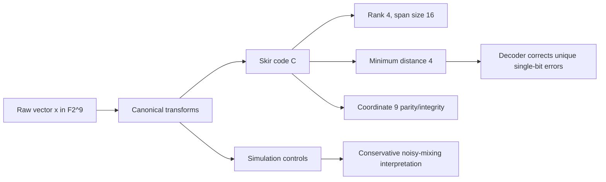

# Adinkra-Stabilized Hypercube Model (ASH Model)

[](LICENSE)
[](https://arxiv.org)

**A Theoretical and Computational Framework for 9-Dimensional Procedural Cosmology**  
**Author**: James Daley (Independent Researcher, Full-Stack Developer, Author)  
**Date**: December 23, 2025

## Abstract

The Adinkra-Stabilized Hypercube Model (ASH Model) is an exploratory simulation-theory and procedural-cosmology framework built on a 9-bit raw state space `F2^9`. In the Skir formulation, the canonical stabilizer layer is a rank-4 doubly-even linear `[9,4,4]` code. Coordinate 9 is treated as a parity/integrity coordinate for the canonical code, not as an unrestricted independent payload coordinate.

Agent-based scripts in this repository visualize noisy hypercube mixing and codeword transforms. Error-correction claims are limited to the explicit nearest-codeword decoder in `src/ash_code.py` and its tests. Simulation outputs should be read as controls and demonstrations, not as standalone proof of runtime correction or empirical physical validation.

The recurrence of nine dimensions is explored through connections to string theory anomaly cancellation, optimal lattice packing (E8, Leech), coding theory, and the modal-logic axioms in `axioms-of-existence.json`.

### Skir canonical code after merge

Skir is now merged into `main` as the repository's canonical code-alignment layer. It keeps the broad ASH research framing while making the executable code boundary explicit:

| Layer | Repository surface | Supported statement |
|---|---|---|
| Raw state space | `F2^9` | 512 binary vectors are available to scripts and exploratory models. |
| Canonical code | `src/ash_code.py` | The Skir code is a rank-4 doubly-even linear `[9,4,4]` code with 16 codewords. |
| Integrity coordinate | coordinate 9 | For canonical codewords, `c9 = c1 xor c2 xor c3 xor c4 xor c5 xor c6 xor c7 xor c8`. |
| Decoder boundary | `decode(...)` | Unique single-bit errors around canonical codewords are corrected by the explicit decoder. |
| Simulation boundary | `simulation.py`, `src/simulate.py`, `tools/run_simulation_controls.py` | Simulations demonstrate noisy hypercube mixing and controls, not standalone physical validation. |



The merged Skir documentation removes unsupported self-dual and Hamming-bound simulation claims, adds explicit decoder tests, and adds controls for noisy hypercube mixing.

## Repository Status

**Active Development** - Preprint manuscript in preparation for submission (target: Q1 2026).
The LaTeX paper compiles to PDF and includes figures, proofs, and references.

## Quick Start

### Prerequisites

Use Python 3.10+ and install required packages before running scripts or tests:

```bash
python -m pip install numpy matplotlib sympy pytest
```

### 1. View the Paper

- Compile locally: `cd latex && pdflatex main.tex && bibtex main && pdflatex main.tex && pdflatex main.tex`
- Or upload the repository to [Overleaf](https://www.overleaf.com) for PDF rendering.

### 2. Run the Simulations

Visualization-focused simulation:

```bash
python simulation.py
```

Data-focused simulation:

```bash
python src/simulate.py
```

Skir control simulations:

```bash
python tools/run_simulation_controls.py --quick
```

`simulation.py` generates a histogram, while `src/simulate.py` writes `data/simulation-results.csv`. `tools/run_simulation_controls.py` compares canonical codeword transforms against no-codeword and random-codeword controls.

### 3. Validate the Skir Code Layer

```bash
python -m compileall .
python -m pytest -q
python tools/audit_claims.py
python tools/run_simulation_controls.py --quick
python tools/verify_branch.py --required-only
python tools/audit_simulation_data.py
```

## Wiki

Wiki source pages are maintained in `wiki/` and should be mirrored to the GitHub Wiki (`ASH-Model.wiki`) when publishing updates. The published wiki should cover:

- the Skir canonical code and decoder boundary;
- the validation commands and control scenarios;
- repository structure and contribution expectations;
- visual logic maps for the code, simulation, and documentation layers.

## Discussions

GitHub Discussions in this repository are supported by repo-grounded automation:

- discussion responders for technical, support, and research/theory questions
- scheduled topic seeding from wiki and paper headings
- moderation against the repository code of conduct

## Repository Contents

- `src/ash_code.py` - Canonical Skir code layer and decoder
- `tests/test_ash_code.py` - Deterministic code and decoder tests
- `tools/audit_claims.py` - Claim-alignment audit
- `tools/run_simulation_controls.py` - Reproducible simulation controls
- `tools/verify_branch.py` - Skir required-file guard
- `docs/skir-code-validation.md` - Skir code-theoretic validation
- `docs/skir-merged-overview.md` - merged Skir overview and navigation map
- `data/simulation-controls.json` - Generated Skir control output
- `docs/` - Research notes, Skir policy docs, and validation reports
- `changelog/CHANGELOG.md` - release and documentation change history
- `latex/main.tex` - Master LaTeX source for the research paper
- `latex/references.bib` - BibTeX references
- `figures/` - Diagrams and generated visualizations
- `simulation.py` - Visualization-focused noisy-mixing demo
- `src/simulate.py` - Data-focused simulation demo
- `scripts/github/` - Discussion and moderation automation scripts
- `axioms-of-existence.json` - Formal modal-logic axiom set
- `data/simulation-results.csv` - Sample raw data

## Citation

Please cite this work as:

Daley, J. (2025). "Adinkra-Stabilized Hypercube Model (ASH Model): A Theoretical Framework for 9-Dimensional Procedural Cosmology." Preprint, in preparation.

## Contributing

Contributions are welcome. Before opening a pull request, review `CONTRIBUTING.md` and run the required checks:

```bash
python -m pip install numpy matplotlib sympy pytest
python -m compileall .
python -m pytest -q
python tools/audit_claims.py
python tools/run_simulation_controls.py --quick
python tools/verify_branch.py --required-only
python tools/audit_simulation_data.py
```

All contributors and discussion participants must follow [CODE_OF_CONDUCT.md](CODE_OF_CONDUCT.md).

## License

This project is licensed under a custom restrictive license - see [LICENSE](LICENSE) for details. Free for educational use and individual experimentation only. All other use is strictly prohibited. Commercial use requires a separate license. Academic citation is required for any use or derivative work.

## Contact

For inquiries, extensions, or collaboration, open an Issue or discuss via GitHub.
