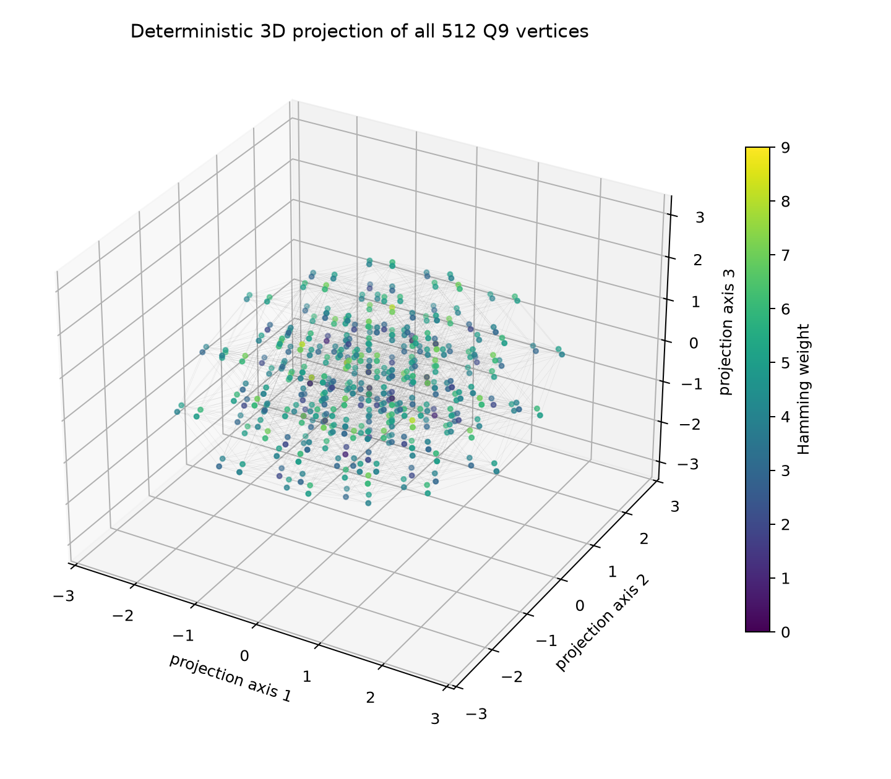
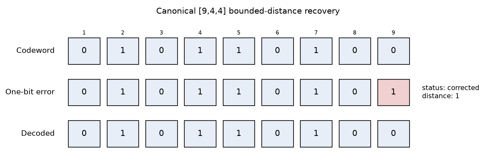
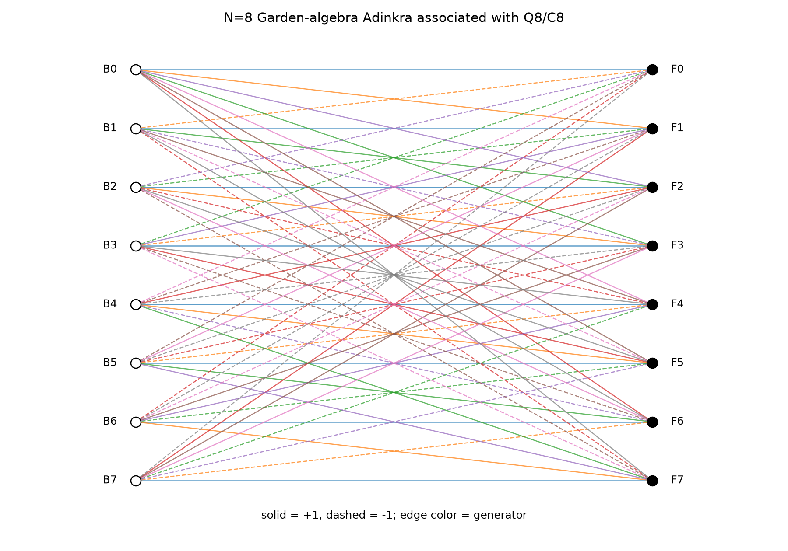
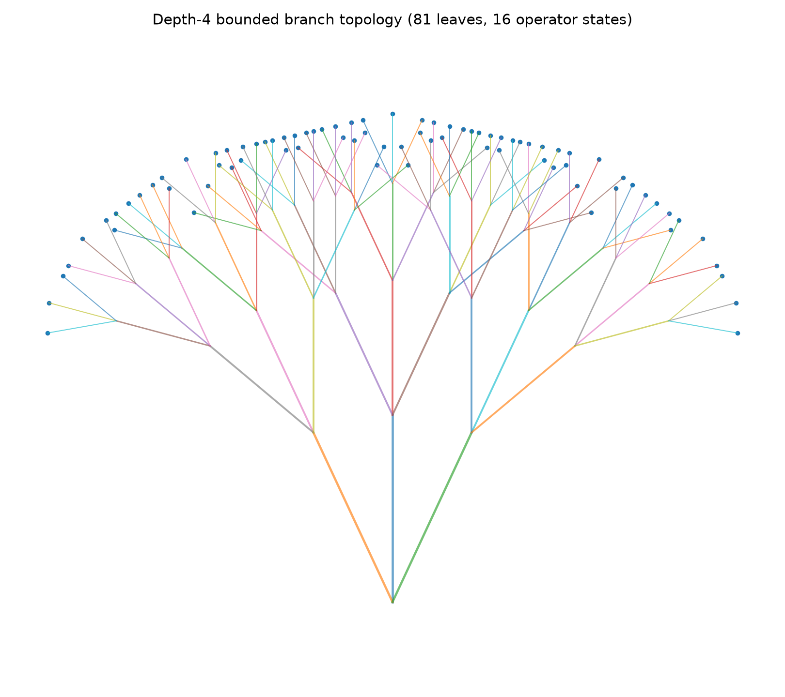
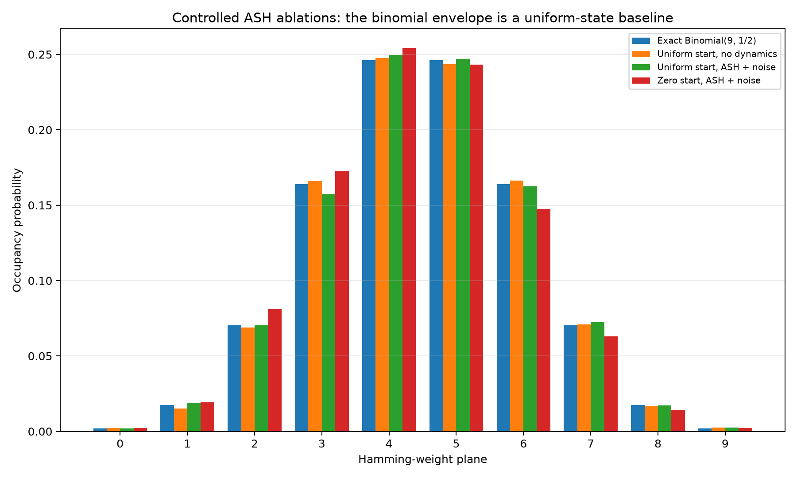

# Adinkra-Stabilized Hypercube Model: Canonical Algebra, Mapping Semantics, and Controlled Simulations

**James Daley**
**Version 1.1.0, June 2026**

## Abstract

The Adinkra-Stabilized Hypercube (ASH) Model is an exploratory finite-state framework built on the binary hypercube `F_2^9`. This paper specifies and proves a canonical mathematical core: a rank-four doubly-even linear `[9,4,4]` transform code, a parity-valid application-state hyperplane, strict one-bit bounded-distance recovery, an idempotent code-orbit averaging projection, and an N=8 Adinkra/Garden representation obtained from the punctured self-dual `[8,4,4]` code. It also defines an executable image/video mapping layer with eight normalized measurements, coordinate-9 parity, temporal hysteresis, bounded branch semantics, deterministic reconstruction operators, source-consistency scoring, and pruning.

Controlled simulations show that the familiar bell-shaped Hamming-weight histogram is the `Binomial(9,1/2)` marginal of uniform occupancy. Because uniform initialization, symmetric bit-flip noise, and arbitrary XOR permutations all preserve or approach this baseline, the histogram is not evidence uniquely caused by ASH transforms. The repository therefore separates proved finite mathematics, deterministic reference computation, and speculative procedural-cosmology interpretation.

## 1. Motivation and research status

ASH investigates whether a compact binary state space can combine code symmetries, graph quotients, procedural branching, and reproducible media-processing semantics. Its contribution at this stage is a coherent finite construction and reference implementation. It is not presented as an empirical cosmology result.

The model's earlier implementation contained a useful coding-theory scaffold but described it imprecisely. In particular, a length-nine code was called self-dual, simulations without a decoder were described as error-correcting, and a random Hamming-weight baseline was described as ASH-specific convergence. Version 1.1.0 repairs those points and makes every executable claim testable.

## 2. The 9-bit state space

Let `V=F_2^9`. Its 512 elements are the vertices of the nine-dimensional hypercube `Q9`. Two vertices are adjacent when they differ in exactly one coordinate. The Hamming plane of `x` is `wt(x)`; plane `k` has `binom(9,k)` vertices.

The exact graph geometry is finite and computable: `Q9` has 2,304 undirected
edges, distance-shell counts `binom(9,r)`, adjacency spectrum `9-2r` with
multiplicity `binom(9,r)`, and unnormalized Laplacian spectral gap `2`.

Application mapping uses the integrity subspace

\[
E=\{x\in V:x_9=x_1\oplus\cdots\oplus x_8\},
\]

which has 256 states. The remaining 256 vertices are retained as integrity-invalid or corrupted states rather than silently discarded.

The pair-flip graph on `E` is the distance-two hypercube graph restricted to
the even-parity subspace.  It has degree 36, 4,608 undirected edges, adjacency
spectrum `36^1, 20^9, 8^36, 0^84, (-4)^126`, and unnormalized Laplacian
spectral gap `16`.  These are state-geometry invariants, not a physical metric.

The corresponding even Hamming shells have degeneracies `(1, 36, 126, 84, 9)`.
The uniform admissible law therefore has mean Hamming weight `9/2`, variance
`9/4`, and zero order parameter.



*Figure 1. A documented linear visualization of all 512 vertices and all 2,304 hypercube edges. The projection is illustrative, not a physical embedding.*

## 3. Canonical doubly-even code

The transform code is generated over `F_2` by

```text
111100000
110011000
101010100
100110001
```

It has parameters `[9,4,4]`, 16 codewords, and weight distribution `{0:1,4:14,8:1}`. It is doubly even and self-orthogonal. It is not self-dual in `F_2^9`, because its dual has dimension five.

Coordinate 9 is active and satisfies the parity relation. Coordinate 8 is zero in every codeword, so code translations preserve the eighth application measurement. Puncturing coordinate 8 produces a doubly-even self-dual `[8,4,4]` code.

The complete codeword table and syndrome values are tracked in `data/codewords.csv`.

## 4. Bounded-distance recovery

Minimum distance four gives guaranteed correction radius one. The decoder accepts a word only when its nearest codeword is unique and at distance zero or one. It rejects all distance-two and distance-three inputs, including cases with a unique nearest codeword at distance two.

The exhaustive state partition is:

```text
16 exact codewords
144 corrected one-bit states
352 rejected states
```

All 576 two-bit corruptions of codewords are rejected. For a known branch anchor `a`, the same guarantee applies to the affine orbit `a+C` by decoding `received xor a`.



*Figure 2. A generated nine-bit codeword example, one-bit corruption, and strict radius-one recovery.*

## 5. Orbit projection

The 16-element code acts on `V` by XOR translation. Its orbits partition `V` into 32 cosets and the integrity subspace into 16 cosets. The averaging operator

\[
(Tf)(x)=\frac1{16}\sum_{c\in C}f(x\oplus c)
\]

is an idempotent projection onto code-orbit-invariant functions. This follows by counting the 16 representations of each sum `a+b=d` in a finite group. The repository implements both exact averaging and an explicitly labeled Monte Carlo estimator. Random movement by one codeword is not conflated with evaluating `T`.

## 6. Adinkra and Garden algebra

Puncturing the code-invariant coordinate gives `C8`. The quotient `Q8/C8` has 16 colored vertices, split by parity into eight bosons and eight fermions. Eight 8-by-8 signed-permutation matrices constructed from Kronecker products satisfy

\[
L_I L_J^T+L_J L_I^T=2\delta_{IJ}I_8
\]

with exact integer residual zero. The quotient colored graph is isomorphic to the matrix graph after a fixed color permutation.



*Figure 3. The executable N=8 Garden representation. Edge colors identify generators; dashed edges encode negative matrix entries.*

This establishes a formal Adinkra layer associated with the punctured code. It does not imply that the nine-dimensional code itself is self-dual.

## 7. Image/video state mapping

Eight normalized measurements define coordinates 1-8:

1. mean luminance;
2. RMS contrast;
3. edge energy;
4. texture residual energy;
5. chroma energy;
6. horizontal-gradient energy;
7. vertical-gradient energy;
8. temporal change.

Fixed thresholds and hysteresis values are specified in `config/ash_mapping_v1.json`. Coordinate 9 is recomputed as XOR parity. The mapping is deterministic, rejects malformed ranges, and preserves integrity across temporal transitions.

## 8. Branch semantics and reconstruction

Each semantic branch node has actions `0`, `+`, and `-` with normalized weights `0.5`, `0.25`, and `0.25`. Actions toggle one of four message bits according to depth; encoding the message selects a codeword and therefore a state in the source state's affine orbit. A depth-four tree has 81 leaves, 121 total nodes, and reaches all 16 operator messages.



*Figure 4. Generated depth-four branch geometry. Multiple leaves may map to the same operator message; their prior weights are aggregated.*

The reference operator family combines horizontal, vertical, isotropic detail injection, and isotropic regularization. Candidates are scored by source re-projection loss, edge loss, and optional temporal loss, then pruned deterministically. This is a conformance implementation for a future production upscaler, not a quality claim.

## 9. Controlled dynamics

For bit-flip probability `0<p<1`, the lazy hypercube kernel is irreducible, aperiodic, symmetric, and doubly stochastic. It has the uniform distribution as its unique stationary state. The Hamming-weight marginal is therefore exactly

\[
\Pr(W=k)=\binom9k2^{-9}.
\]

Codeword translations are permutations and also preserve uniformity. Consequently, a bell-shaped Hamming histogram from a uniform start or symmetric noise is a baseline shared by ASH and non-ASH controls.



*Figure 5. Tracked controls compared with the exact binomial envelope. The figure is evidence for the baseline analysis, not for unique ASH causation.*

The no-noise, all-zero, ASH-transform case remains in the 16-state code orbit and exhibits the code's `{0,4,8}` weight support rather than a full binomial distribution.

## 10. Verification

The repository includes:

- exhaustive tests across all 512 states;
- all one-bit and two-bit codeword neighborhoods;
- 36,864 affine one-bit recovery checks;
- exact Garden identities and quotient-graph isomorphism;
- state-reference, codeword, branch, and ablation artifacts;
- source and artifact SHA-256 manifests.

The generated certificate reports all checks passing. The mathematical proofs are stated independently in `docs/mathematical-proof.md`.

## 11. Limitations and falsifiability

The finite algebra is fully specified and falsifiable by direct counterexample. The feature thresholds, branch priors, geometry constants, reconstruction operators, and score weights are versioned reference-design choices rather than uniquely derived physical constants or empirically optimized parameters. They require quality evaluation against matched baselines before production use. Procedural-cosmology interpretation remains speculative and requires separately formulated observational predictions.

The model does not currently establish:

- empirical cosmological validation;
- a derivation of quantum measurement probabilities;
- ASH-specific Gaussian statistics;
- physical supersymmetry in observed data;
- state-of-the-art image or video upscaling.

## 12. Conclusion

ASH 1.1.0 provides a rigorous finite scaffold: a parity-explicit 9-bit state system, a doubly-even `[9,4,4]` code, strict error recovery, exact orbit projection, an executable N=8 Adinkra/Garden layer, bounded branch semantics, and deterministic media mapping. Its statistical claims are now controlled, and its interpretive claims are clearly separated from proven mathematics.

## References

- Doran, C. F., Faux, M. G., Gates, S. J., Jr., Hübsch, T., Iga, K. M., and Landweber, G. D. (2007). On graph-theoretic identifications of Adinkras, supersymmetry representations and superfields. *International Journal of Modern Physics A*, 22, 869-930.
- Faux, M., and Gates, S. J. (2005). Adinkras: A graphical technology for supersymmetric representation theory.
- MacWilliams, F. J., and Sloane, N. J. A. (1977). *The Theory of Error-Correcting Codes*.
- Norris, J. R. (1997). *Markov Chains*.
