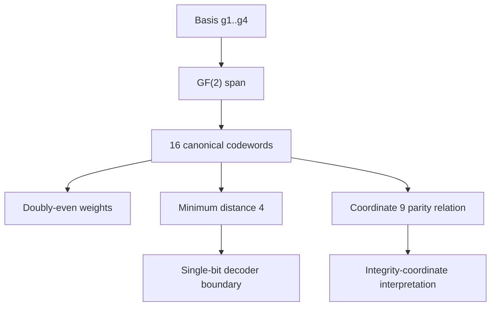

# ASH Canonical Code - Skir Formulation

## Scope

This document defines the canonical code layer for ASH after the Skir merge into `main`. It is a code-theoretic specification, not a narrative interpretation document.

## Summary

Skir defines the canonical ASH code as a parity-explicit rank-4 doubly-even linear `[9,4,4]` code over `F2^9`. Coordinate 9 is the parity/integrity coordinate for canonical codewords.

```text
C = span_F2({g1, g2, g3, g4})
|C| = 16
d_min(C) = 4
```

## Raw state space

ASH may use the raw binary state space:

```text
F2^9
```

This contains 512 raw binary vectors. Skir distinguishes raw binary vectors from canonical codewords and decoder targets.

## Canonical basis

The canonical code `C` is generated over GF(2) by the first four basis rows:

```text
g1 = 1 1 1 1 0 0 0 0 0
g2 = 1 1 0 0 1 1 0 0 0
g3 = 1 0 1 0 1 0 1 0 0
g4 = 1 0 0 1 1 0 0 0 1
```

Two additional canonical transform masks used by simulation scripts are members of the same span:

```text
g5 = 1 1 1 1 1 1 1 0 1
g6 = 0 0 0 0 1 1 1 0 1
```

Computed properties:

| Property | Value |
|---|---:|
| Length | 9 |
| Rank | 4 |
| Span size | 16 |
| Minimum distance | 4 |
| Weight distribution | `{0: 1, 4: 14, 8: 1}` |
| Doubly-even | yes |
| Coordinate 9 active | yes |
| Coordinate 9 parity relation | yes |
| Self-dual | no |

## Logic map



## Coordinate 9 parity relation

For each canonical codeword `c`:

```text
c9 = c1 XOR c2 XOR c3 XOR c4 XOR c5 XOR c6 XOR c7 XOR c8
```

This makes coordinate 9 an integrity coordinate for the canonical code. Because all canonical codewords are doubly-even, the code is stricter than an ordinary even-parity code.

Human coordinate 8 is fixed to 0 in the current canonical presentation. Coordinate 9 remains active and parity-valid.

## Decoder claim

The Skir decoder corrects unique single-bit errors around the 16 canonical codewords. It does not silently correct multi-bit errors under the default correction radius.

## Simulation claim

The simulation scripts visualize noisy hypercube mixing and codeword transforms. They do not by themselves prove runtime error correction. Error-correction claims are limited to explicit decoder tests.

## Limitations

- The canonical code is not self-dual.
- Coordinate 9 is active as parity/integrity, but this does not imply all nine coordinates are independent payload dimensions.
- The first eight coordinates are a restricted admissible pre-parity layer for canonical codewords.
- The simulation controls support conservative noisy-mixing language, not stronger occupancy-causation claims.
