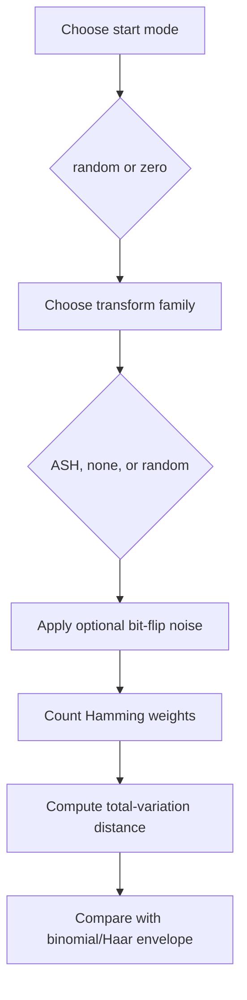

# Falsification and Controls - Skir Branch

## Purpose

This document records the controls added in Skir to prevent unsupported claims.

## Claims Skir supports

| Claim | Support |
|---|---|
| Canonical code has rank 4 | `tests/test_ash_code.py` |
| Canonical code has 16 codewords | `tests/test_ash_code.py` |
| Canonical code is doubly-even | `tests/test_ash_code.py` |
| Canonical code has minimum distance 4 | `tests/test_ash_code.py` |
| Coordinate 9 is active parity/integrity coordinate | `tests/test_ash_code.py` |
| Single-bit errors are corrected by decoder | `tests/test_ash_code.py` |
| Double-bit errors are not silently corrected | `tests/test_ash_code.py` |
| Noisy simulation approaches binomial/Haar envelope | `tools/run_simulation_controls.py` |

## Claims Skir does not support

| Claim | Status |
|---|---|
| The code is self-dual | false / removed |
| Simulation proves Hamming-bound resilience | unsupported / removed |
| ASH codewords uniquely cause Gaussian occupancy | unsupported / replaced with controls |
| ASH is empirically validated physical cosmology | not established |
| L-system branch strings demonstrate quantum measurement statistics | not established unless separately implemented and tested |

## Required controls

Run:

```bash
python tools/run_simulation_controls.py --quick
```

For full local control output:

```bash
python tools/run_simulation_controls.py
```

The controls compare:

1. canonical ASH codewords + noise,
2. no codewords + noise,
3. random codewords + noise,
4. all-zero start + ASH codewords + no noise,
5. all-zero start + ASH codewords + noise.

## Control logic



The control output intentionally compares ASH transforms against alternative transform choices. If multiple noisy runs approach the same envelope, the documentation must not attribute the result uniquely to ASH codewords.

## Interpretation

If noisy runs approach the binomial envelope across multiple transform choices, documentation must say noisy hypercube mixing rather than a code-specific cause.

If codeword-only runs remain confined or non-binomial from atypical starts, documentation must not claim initial-condition-independent convergence from the deterministic codeword layer alone.

## Reproducibility

Control output should be written to:

```text
data/simulation-controls.json
```

Use `docs/skir-merged-overview.md` and the GitHub Wiki pages as the public navigation layer for these controls.
