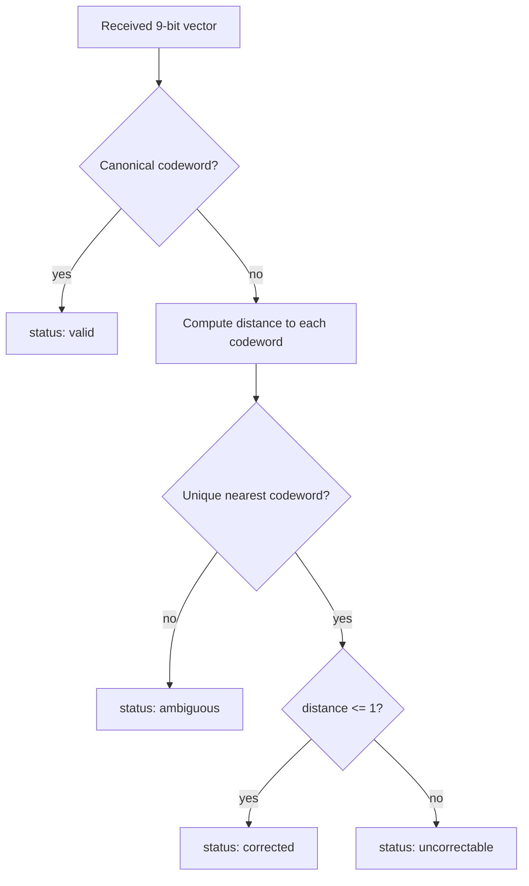
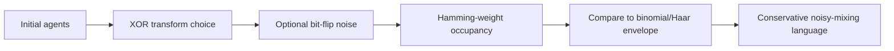

# Skir Merged Overview

## Purpose

This page summarizes the Skir merge into `main` and provides a navigation map for the current ASH documentation, validation scripts, and wiki pages.

## Merge context

Skir was merged into `main` through PR #52 on 2026-06-15. The merge made the Skir code-alignment layer the current repository baseline:

- `src/ash_code.py` defines the canonical code and decoder.
- `tests/test_ash_code.py` verifies code-theoretic properties and decoder behavior.
- `tools/audit_claims.py` prevents recurrence of unsupported claim language.
- `tools/run_simulation_controls.py` compares canonical transforms with control baselines.
- `tools/verify_branch.py --required-only` checks that the required Skir files remain present on `main`.

## Code layer

The canonical code is a parity-explicit rank-4 doubly-even linear `[9,4,4]` code over `F2^9`.

```text
C = span_F2({g1, g2, g3, g4})
|C| = 2^4 = 16
d_min(C) = 4
```

For each canonical codeword `c`:

```text
c9 = c1 xor c2 xor c3 xor c4 xor c5 xor c6 xor c7 xor c8
```

Coordinate 9 is therefore an integrity coordinate for the canonical code. This does not make all nine coordinates independent payload coordinates.

## Decoder boundary

The explicit decoder in `src/ash_code.py` uses nearest-codeword decoding with a default correction radius of 1.



The decoder tests prove unique single-bit correction around canonical codewords and no silent correction of double-bit errors under the default radius.

## Simulation boundary

Simulation scripts demonstrate transforms and noisy hypercube mixing. They do not prove runtime decoder correction or empirical physical validation.



## Documentation map

| Document | Role |
|---|---|
| `README.md` | User entrypoint, quick start, and Skir summary |
| `docs/canonical-code.md` | Canonical code specification |
| `docs/skir-code-validation.md` | Code-theoretic validation details |
| `docs/falsification-and-controls.md` | Supported and unsupported claims |
| `docs/claim-language-policy.md` | Required claim wording |
| `docs/repository-review.md` | Repository consistency report |
| `wiki/` | Source mirror for GitHub Wiki pages |

## Validation commands

Run from the repository root:

```bash
python -m pip install numpy matplotlib sympy pytest
python -m compileall .
python -m pytest -q
python tools/audit_claims.py
python tools/run_simulation_controls.py --quick
python tools/verify_branch.py --required-only
python tools/audit_simulation_data.py
```

## Claim boundary

Supported:

- the Skir code has rank 4, span size 16, doubly-even weights, and minimum distance 4;
- coordinate 9 is active and parity-valid for canonical codewords;
- the explicit decoder corrects unique single-bit errors around canonical codewords;
- controls support conservative noisy-mixing language.

Not established:

- the code is self-dual;
- simulations independently prove runtime error correction;
- ASH codewords uniquely cause a specific occupancy distribution;
- ASH is empirically validated as a physical cosmology.
