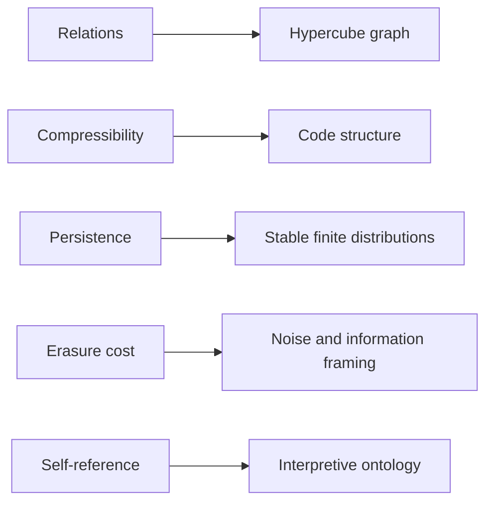

# Axioms of Existence

`axioms-of-existence.json` records the interpretive axiom layer. These axioms provide vocabulary for relation, compressibility, persistence, erasure cost, and self-reference.

## Status

The axiom layer is interpretive. It does not replace finite proofs, executable validation, or empirical evidence.

## Relationship to ASH

## Reading rule

Use the axiom file to understand the conceptual language of the project. Use the proof certificate, tests, and validation artifacts to evaluate executable claims.
