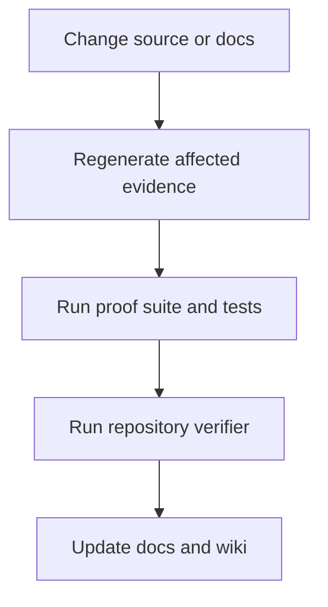

# Codebase Overview

## Main modules

| Path | Role |
|---|---|
| `src/ash_model/bits.py` | binary-state helpers |
| `src/ash_model/code.py` | canonical `[9,4,4]` code and decoder |
| `src/ash_model/hypercube.py` | Q9 geometry, projections, spectra |
| `src/ash_model/adinkra.py` | quotient and Garden algebra |
| `src/ash_model/features.py` | image/video feature measurements |
| `src/ash_model/branching.py` | bounded branch topology |
| `src/ash_model/reconstruction.py` | reconstruction operators |
| `src/ash_model/pipeline.py` | reference mapping pipeline |
| `src/ash_model/physics.py` | finite-observer ASH-Physics layer |
| `src/ash_model/empirical.py` | calibration and likelihood contracts |
| `src/ash_model/cosmology.py` | dimensionless baseline comparator |

## Tooling

| Tool | Role |
|---|---|
| `tools/generate_artifacts.py` | regenerate data and bind figures |
| `tools/build_manuscript.py` | write manuscript source-input manifest |
| `tools/run_proof_suite.py` | write computational certificate |
| `tools/verify_repository.py` | fail on stale source, artifacts, versions, or overclaims |
| `tools/check_generated_outputs.py` | verify generated outputs do not drift |
| `tools/audit_physics_readiness.py` | report open science blockers |
| `tools/audit_live_repository_readiness.py` | check repository-readiness boundary |

## Development shape

