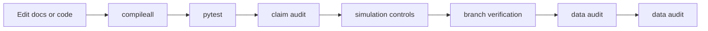

# Consistency Checklist

Use this checklist when updating docs, scripts, data, or wiki pages.

## Accuracy checks

- Commands in wiki pages match `README.md`, `CONTRIBUTING.md`, and executable scripts.
- Output file names match current code behavior:
  - `figures/simulation-histogram-generated.png`
  - `data/simulation-results.csv`
  - `data/simulation-controls.json`
- Skir code claims match `src/ash_code.py` and `tests/test_ash_code.py`.
- Claim language follows `docs/claim-language-policy.md`.
- The README, docs, and wiki agree that simulations are demos and controls, not standalone proof of decoder behavior.
- The license reference points to the repository `LICENSE` file.

## Validation workflow



## Review commands

```bash
python -m pip install numpy matplotlib sympy pytest
python -m compileall .
python -m pytest -q
python tools/audit_claims.py
python tools/run_simulation_controls.py --quick
python tools/verify_branch.py --required-only
python tools/audit_simulation_data.py
python scripts/github/discussion_agent.py --validate-config --root .
python scripts/github/discussion_topic_agent.py --validate-config --root .
python scripts/github/discussion_moderation_agent.py --validate-config --root .
```

## Claim-language checks

Allowed:

- `rank-4 doubly-even linear [9,4,4] code over F2^9`
- `coordinate 9 as the parity/integrity coordinate`
- `The decoder corrects unique single-bit errors around canonical codewords.`
- `Noisy hypercube mixing approaches the expected binomial/Haar occupancy envelope.`

Avoid:

- positive self-dual claims;
- simulation-only error-correction claims;
- unsupported code-specific occupancy claims;
- statements that all interpretive or physical claims are verified.

## Publication note

The GitHub Wiki is hosted as a separate repository: `ASH-Model.wiki.git`. Update the live wiki after updating the tracked `wiki/` source pages.
