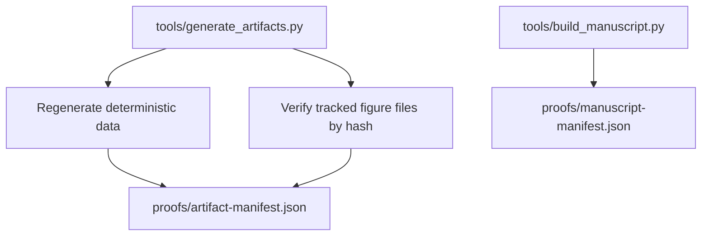

# Evidence and Artifacts

This page describes how repository evidence is generated and checked.

## Artifact policy



The default generator does not redraw tracked PNG figures. It verifies their committed bytes and records them in `proofs/artifact-manifest.json`. Use `--refresh-figures` only when intentionally updating the tracked figure files.

## Generated data

| Path | Role |
|---|---|
| `data/codewords.csv` | all messages, codewords, weights, and syndromes |
| `data/ash-state-reference.csv` | all 512 states and decoder/orbit metadata |
| `data/branch-topology.json` | depth-4 bounded branch topology |
| `data/simulation-results.csv` | seeded terminal simulation sample |
| `data/simulation-metadata.json` | simulation parameters and interpretation |
| `data/ablation-results.csv` | matched controls and ablations |
| `data/ash-cosmology/linear-perturbations/v0.1/` | R-007 finite perturbation transfer artifacts |
| `data/ash-cosmology/branch-measure/v0.1/` | R-008 finite branch-measure artifacts |
| `data/ash-cosmology/observer-commitment/v0.1/` | R-009 observer-commitment and branch-separation artifacts |
| `data/ash-cosmology/unit-bridge/v0.1/` | R-010 synthetic unit-bearing bridge artifacts |
| `data/ash-cosmology/finite-observer-limit/v0.1/` | R-011 finite-observer hierarchy artifacts |
| `data/manifests/data_manifest.json` | consolidated evidence inventory and checksums |

## Figures

| Path | Role |
|---|---|
| `figures/hypercube-3d-projection.png` | deterministic projection of Q9 vertices |
| `figures/adinkra-graph-colored.png` | Garden-algebra Adinkra layer |
| `figures/single-bit-error.png` | strict decoder recovery example |
| `figures/simulation-histogram.png` | controlled ablation plot |
| `figures/branch-topology.png` | bounded branch topology |
| `figures/ash-cosmology/linear-perturbations/v0.1/` | R-007 finite perturbation visuals |
| `figures/ash-cosmology/finite-observer-limit/v0.1/` | R-011 finite hierarchy visuals |
| `figures/ash-physics-sector-mixing/` | sector-mixing pass 002 finite workbench visuals |

## Roadmap evidence matrix

| Roadmap | Generated evidence | Validation evidence |
|---|---|---|
| R-007 | `data/ash-cosmology/linear-perturbations/v0.1/` | `validation/linear-perturbations/roadmap-007/outputs/verification.json` |
| R-008 | `data/ash-cosmology/branch-measure/v0.1/` | `validation/branch-measure/roadmap-008/outputs/verification.json` |
| R-009 | `data/ash-cosmology/observer-commitment/v0.1/` | `validation/observer-commitment/roadmap-009/outputs/verification.json` |
| R-010 | `data/ash-cosmology/unit-bridge/v0.1/` | `validation/unit-bridge/roadmap-010/outputs/verification.json` |
| R-011 | `data/ash-cosmology/finite-observer-limit/v0.1/` | `validation/finite-observer-limit/roadmap-011/outputs/verification.json` |

## Verification commands

```bash
python tools/generate_artifacts.py
python tools/run_proof_suite.py
python tools/validate_data_manifest.py --manifest data/manifests/data_manifest.json
python tools/check_generated_outputs.py . --include-manuscript
python tools/verify_repository.py
```
