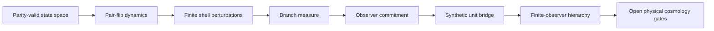

# Finite-Observer Physics

ASH-Physics v0.2 is a conservative finite-state layer built over the verified ASH kernel. The repository now carries finite evidence through Roadmap 011: finite perturbation shells, branch measure, observer commitment, a synthetic unit-bearing bridge, and a nested finite-observer hierarchy.

## Implemented finite layer

| Item | Status |
|---|---|
| Admissible physical state space | 256 parity-valid states |
| Microscopic update | lazy pair-flip Markov kernel |
| Continuous-time form | finite generator |
| Event graph | finite pair-flip graph |
| Background surrogate | Hamming-weight lumping |
| Perturbation layer | finite quotient Walsh-character shells and bounded lazy pair-flip mode factors |
| Branch measure | finite Gibbs/action-weighted sibling law |
| Observer commitment | finite committed-memory push-forward and branch-separation checks |
| Observables | dimensionless internal vector plus synthetic R-010 unit-bearing proxy bridge |
| Finite-observer hierarchy | nested parity-valid levels `1,3,5,7,9` with projective consistency |
| Calibration | explicit affine contract plus synthetic fiducial R-010 calibration |
| Prediction ledger | hash-lock mechanics without locked entries |

## Finite route

## R-010 synthetic unit-bearing bridge

Roadmap 010 introduces a finite bridge

\[
\mathcal{B}_{\ell}:(\Gamma,\mathcal{T},\mu,\mathcal{M};\Theta_{\ell})\to\mathcal{Y}_{\ell}
\]

from finite branch-ensemble summaries to named unit-bearing proxy observables. It computes synthetic columns for time, coarse length, dimensionless scale factor, bridge expansion rate, energy density, mass density, curvature proxy, memory length, and temperature proxy.

| R-010 evidence | Repository path |
|---|---|
| implementation | `src/ash_model/unit_bridge.py` |
| generator | `tools/generate_unit_bridge.py` |
| calibration contract | `config/ash_r010_unit_bridge_calibration.json` |
| tests | `tests/test_unit_bridge.py` |
| data outputs | `data/ash-cosmology/unit-bridge/v0.1/` |
| validation output | `validation/unit-bridge/roadmap-010/outputs/verification.json` |

The R-010 constants are fiducial synthetic defaults. They are not reviewed physical constants.

## R-011 finite-observer hierarchy

Roadmap 011 closes the finite-observer limit route without claiming a differentiable continuum. For odd levels

\[
n\in\{1,3,5,7,9\},
\]

the verified observer state space is

\[
\Omega_n=\{x\in\mathbb F_2^n:\sum_i x_i=0\pmod 2\}.
\]

The projective observer map from \(n\) to \(m\le n\) is

\[
\pi_{m,n}(x_1,\ldots,x_n)
=
(x_1,\ldots,x_{m-1},\sum_{i=1}^{m-1}x_i \bmod 2).
\]

The package verifies projective consistency, uniform fiber sizes, shell counts, finite cone counts, event non-expansion, and the \(n=9\) halved-cube spectrum.

| R-011 evidence | Repository path |
|---|---|
| implementation | `src/ash_model/finite_observer_limit.py` |
| generator | `tools/generate_finite_observer_limit.py` |
| contract | `config/ash_r011_finite_observer_limit_contract.json` |
| tests | `tests/test_finite_observer_limit.py` |
| data outputs | `data/ash-cosmology/finite-observer-limit/v0.1/` |
| figures | `figures/ash-cosmology/finite-observer-limit/v0.1/` |
| validation output | `validation/finite-observer-limit/roadmap-011/outputs/verification.json` |

## Boundary

This layer is finite. R-010 adds synthetic unit-bearing proxy columns, but the default calibration is fiducial and repository-local. R-011 adds finite causal adjacency and reachability in a graph hierarchy, but it does not derive a physical light cone. The layer is not a reviewed unit-bearing spacetime theory, not a Lorentzian metric derivation, not an Einstein-equation derivation, not an external-data likelihood result, and not an empirical cosmology claim.

## Implementation evidence

- `src/ash_model/physics.py`
- `src/ash_model/empirical.py`
- `src/ash_model/cosmology.py`
- `src/ash_model/unit_bridge.py`
- `src/ash_model/finite_observer_limit.py`
- `tests/test_physics.py`
- `tests/test_empirical_bridge.py`
- `tests/test_cosmology.py`
- `tests/test_unit_bridge.py`
- `tests/test_finite_observer_limit.py`
- `theory/`
- `phenomenology/`

## Open transition

The next scientific step is not more repository scaffolding. It is reviewed physical calibration and derivation work: physical perturbation equations, ASH-derived background equations, external datasets with covariance models, matched baselines, and frozen predictions.
