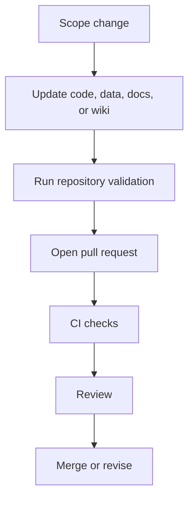

# Governance and Discussions

## Governance surfaces

| Surface | File |
|---|---|
| Contribution process | `CONTRIBUTING.md` |
| Pull request template | `.github/pull_request_template.md` |
| Code of conduct | `CODE_OF_CONDUCT.md` |
| Discussion response policy | `docs/governance/github_automation_agents.md` |
| Moderation policy | `docs/governance/discussion_moderation_policy.md` |
| Workflow definitions | `.github/workflows/` |

## Pull request lifecycle

## Documentation rule

If a change affects commands, outputs, generated evidence, finite-theory status, science blockers, or public claims, update README, docs, changelog, and wiki source together.
