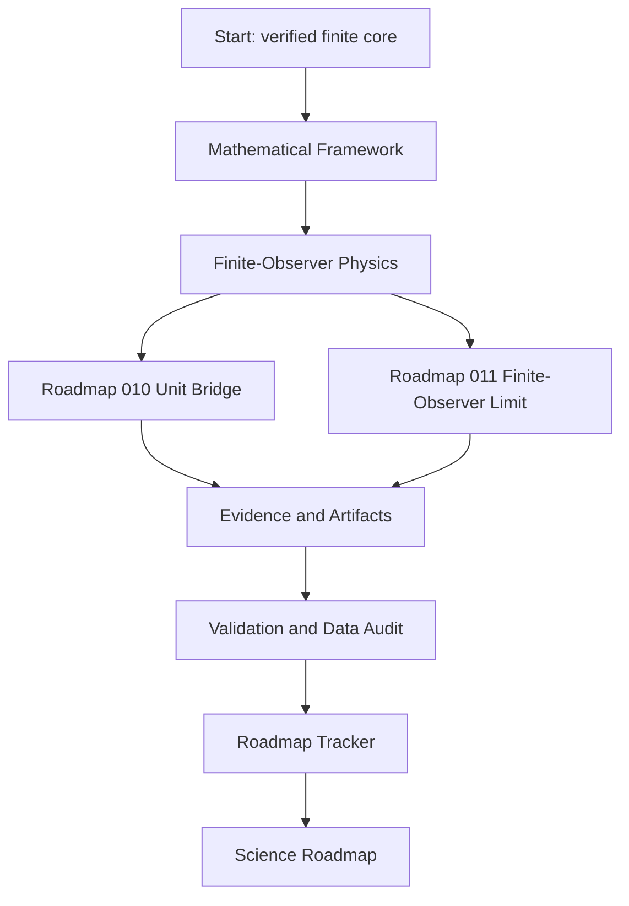

# ASH Model Wiki

The Adinkra-Stabilized Hypercube Model is a finite-state reference framework for verified 9-bit hypercube mathematics, a parity-explicit `[9,4,4]` code, Adinkra/Garden algebra checks, deterministic state mapping, controlled evidence artifacts, and a conservative finite-observer physics layer.

## Current status

| Layer | Status | Evidence |
|---|---|---|
| Finite ASH mathematics | Verified | `proofs/computational-certificate.json`, `tests/` |
| Mapping and pipeline semantics | Verified reference implementation | `src/ash_model/`, `config/ash_mapping_v1.json` |
| Evidence artifacts | Hash-bound and repository-checked | `proofs/artifact-manifest.json` |
| ASH-Physics finite-observer layer | Implemented finite-state theory through R-011 | `src/ash_model/physics.py`, `src/ash_model/unit_bridge.py`, `src/ash_model/finite_observer_limit.py` |
| Synthetic unit-bearing bridge | Complete as R-010 workbench | `docs/ash-cosmology/unit-bridge/roadmap-010/`, `validation/unit-bridge/roadmap-010/outputs/verification.json` |
| Finite-observer hierarchy | Complete as R-011 finite route | `docs/ash-cosmology/finite-observer-limit/roadmap-011/`, `validation/finite-observer-limit/roadmap-011/outputs/verification.json` |
| Physical cosmology | Open science work | `ROADMAP.md`, `docs/remediation/physics-readiness.json` |
| Locked predictions | Not yet present | `predictions/prediction-ledger.json` |

## Reading map



## Core facts

- The state space is `F_2^9`, with 512 states.
- The application-valid hyperplane has 256 parity-valid states.
- Coordinate 9 is an active parity/integrity coordinate.
- The rank-four code is doubly even with parameters `[9,4,4]`.
- The nine-dimensional code is not self-dual.
- Puncturing the invariant coordinate yields a self-dual doubly-even `[8,4,4]` code.
- Single-bit correction is a decoder result, not an automatic simulation effect.
- Bell-shaped Hamming histograms are controlled finite-hypercube baselines, not standalone evidence for physical cosmology.
- Roadmap 010 maps finite observer summaries to synthetic SI-unit proxy columns under a fiducial calibration contract.
- Roadmap 011 verifies a nested finite-observer hierarchy over odd levels `1,3,5,7,9` with projective consistency, uniform fibers, finite cones, event non-expansion, and generated figures.

## Verification quick start

```bash
python -m pip install -e ".[dev]"
python tools/generate_artifacts.py
python tools/build_manuscript.py
python tools/run_proof_suite.py
python -m pytest
python tools/verify_repository.py
python tools/validate_data_manifest.py --manifest data/manifests/data_manifest.json
python tools/check_generated_outputs.py . --include-manuscript
```

The repository currently verifies 143 collected tests plus proof-suite, manifest, generated-output, and repository-gate checks. The strongest roadmap summary is `ROADMAP.md`; the strongest repository-readiness audit remains `docs/final-live-repository-audit.md`, with R010/R011 post-audit work now represented by the roadmap tracker, proof certificate, data manifest, validation JSON, and merged CI checks.
