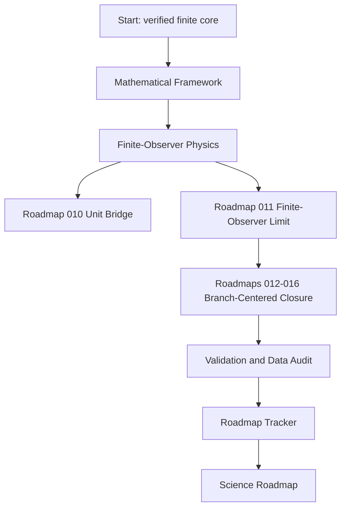

# ASH Model Wiki

The Adinkra-Stabilized Hypercube Model is a finite-state reference framework for verified 9-bit hypercube mathematics, a parity-explicit `[9,4,4]` code, Adinkra/Garden algebra checks, deterministic state mapping, controlled evidence artifacts, and a conservative finite-observer physics layer.

## Current status

| Layer | Status | Evidence |
|---|---|---|
| Finite ASH mathematics | Verified | `proofs/computational-certificate.json`, `tests/` |
| Mapping and pipeline semantics | Verified reference implementation | `src/ash_model/`, `config/ash_mapping_v1.json` |
| Evidence artifacts | Hash-bound and repository-checked | `proofs/artifact-manifest.json` |
| ASH-Physics finite-observer and branch-centered layer | Implemented through R-016 within scoped finite, synthetic, readiness, lock-mechanics, and formal-contract boundaries | `src/ash_model/physics.py`, `src/ash_model/unit_bridge.py`, `src/ash_model/finite_observer_limit.py`, `src/ash_model/branch_centered_closure.py` |
| Synthetic unit-bearing bridge | Complete as R-010 workbench | `docs/ash-cosmology/unit-bridge/roadmap-010/`, `validation/unit-bridge/roadmap-010/outputs/verification.json` |
| Finite-observer hierarchy | Complete as R-011 finite route | `docs/ash-cosmology/finite-observer-limit/roadmap-011/`, `validation/finite-observer-limit/roadmap-011/outputs/verification.json` |
| R012-R016 branch-centered package | Complete as synthetic/readiness/lock/formal repository work | `docs/ash-cosmology/background-equations/roadmap-012/`, `docs/ash-cosmology/branch-centered-closure/roadmap-016/` |
| Physical cosmology validation | Open science work | `ROADMAP.md`, `docs/remediation/physics-readiness.json` |
| Locked prediction templates | Present as R-015 immutable prospective templates; future observed-data comparison remains pending | `predictions/locked/`, `validation/locked-predictions/roadmap-015/outputs/verification.json` |

## Reading map



## Core facts

- The state space is `F_2^9`, with 512 states.
- The application-valid hyperplane has 256 parity-valid states.
- Coordinate 9 is an active parity/integrity coordinate.
- The rank-four code is doubly even with parameters `[9,4,4]`.
- The nine-dimensional code is not self-dual.
- Puncturing the invariant coordinate yields a self-dual doubly-even `[8,4,4]` code.
- Single-bit correction is a decoder result, not an automatic simulation effect.
- Bell-shaped Hamming histograms are controlled finite-hypercube baselines, not standalone evidence for physical cosmology.
- Roadmap 010 maps finite observer summaries to synthetic SI-unit proxy columns under a fiducial calibration contract.
- Roadmap 011 verifies a nested finite-observer hierarchy over odd levels `1,3,5,7,9` with projective consistency, uniform fibers, finite cones, event non-expansion, and generated figures.
- Roadmap 012 adds a synthetic finite-observer background-equation workbench and exact standard-baseline relation.
- Roadmap 013 adds a bounded matter-sector perturbation workbench, not a full photon-baryon Boltzmann hierarchy.
- Roadmap 014 adds external-likelihood readiness and synthetic fixtures, not observed-data likelihood scoring.
- Roadmap 015 adds immutable prospective prediction templates, not empirical validation.
- Roadmap 016 adds formal branch-centered repository-contract closure, not physical model validation.

## Verification quick start

```bash
python3 -m pip install -e ".[dev]"
python3 tools/generate_artifacts.py
python3 tools/build_manuscript.py
python3 tools/run_proof_suite.py
python3 -m pytest
python3 tools/verify_repository.py
python3 tools/validate_data_manifest.py --manifest data/manifests/data_manifest.json
python3 tools/check_generated_outputs.py . --include-manuscript
```

The repository verifies through the pytest suite plus proof-suite, manifest, generated-output, and repository-gate checks. The strongest current roadmap summary is `ROADMAP.md`; current R012-R016 evidence is represented by the roadmap tracker, proof certificate, data manifest, validation JSON, and remediation evidence, while `docs/final-live-repository-audit.md` remains a historical readiness audit.
