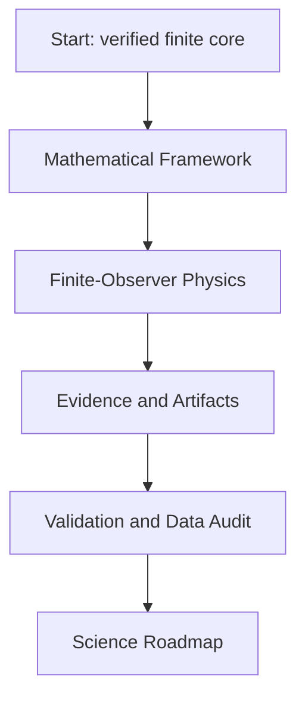

# ASH Model Wiki

The Adinkra-Stabilized Hypercube Model is a finite-state reference framework for verified 9-bit hypercube mathematics, a parity-explicit `[9,4,4]` code, Adinkra/Garden algebra checks, deterministic state mapping, controlled evidence artifacts, and a conservative finite-observer physics layer.

## Current status

| Layer | Status | Evidence |
|---|---|---|
| Finite ASH mathematics | Verified | `proofs/computational-certificate.json`, `tests/` |
| Mapping and pipeline semantics | Verified reference implementation | `src/ash_model/`, `config/ash_mapping_v1.json` |
| Evidence artifacts | Hash-bound and repository-checked | `proofs/artifact-manifest.json` |
| ASH-Physics finite-observer layer | Implemented finite-state theory | `src/ash_model/physics.py`, `tests/test_physics.py` |
| Physical cosmology | Open science work | `docs/remediation/physics-readiness.json` |
| Locked predictions | Not yet present | `predictions/prediction-ledger.json` |

## Reading map



## Core facts

- The state space is `F_2^9`, with 512 states.
- The application-valid hyperplane has 256 parity-valid states.
- Coordinate 9 is an active parity/integrity coordinate.
- The rank-four code is doubly even with parameters `[9,4,4]`.
- The nine-dimensional code is not self-dual.
- Puncturing the invariant coordinate yields a self-dual doubly-even `[8,4,4]` code.
- Single-bit correction is a decoder result, not an automatic simulation effect.
- Bell-shaped Hamming histograms are controlled finite-hypercube baselines, not standalone evidence for physical cosmology.

## Verification quick start

```bash
python -m pip install -e ".[dev]"
python tools/generate_artifacts.py
python tools/build_manuscript.py
python tools/run_proof_suite.py
python -m pytest
python tools/verify_repository.py
```

The strongest current summary is `docs/final-live-repository-audit.md`.
