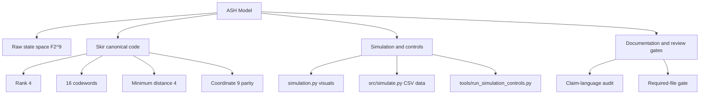

> **Canonical source**: `README.md`, `docs/skir-merged-overview.md`
> **Last updated**: 2026-06-15

# ASH Model Wiki

The Adinkra-Stabilized Hypercube Model (ASH Model) is an exploratory simulation-theory and procedural-cosmology framework over the 9-bit raw state space `F2^9`.

The merged Skir baseline makes the executable code layer explicit: the canonical ASH stabilizer layer is a parity-explicit rank-4 doubly-even linear `[9,4,4]` code with coordinate 9 as the parity/integrity coordinate.

## Visual navigation



## Start here

| Page | Use it for |
|---|---|
| [[Skir-Canonical-Code]] | Code definition, formulas, parity relation, decoder boundary |
| [[Skir-Validation-and-Controls]] | Validation commands, control scenarios, claim limits |
| [[Simulation-Guide]] | Running visual, data, and control scripts |
| [[Repository-Structure]] | File map for code, docs, data, and automation |
| [[Consistency-Checklist]] | Review checklist before changing docs or scripts |

## Core formulas

The canonical code is:

```text
C = span_F2({g1, g2, g3, g4})
|C| = 2^4 = 16
d_min(C) = 4
```

For every canonical codeword `c`:

```text
c9 = c1 xor c2 xor c3 xor c4 xor c5 xor c6 xor c7 xor c8
```

The decoder boundary follows the standard minimum-distance rule:

```text
2t < d
2(1) < 4
```

## Current claim boundary

Supported:

- the Skir code has rank 4, span size 16, doubly-even weights, and minimum distance 4;
- coordinate 9 is active and parity-valid for canonical codewords;
- the explicit decoder corrects unique single-bit errors around canonical codewords;
- simulation controls support conservative noisy-mixing language.

Not established:

- the code is self-dual;
- simulation scripts independently prove runtime error correction;
- ASH codewords uniquely cause a specific occupancy distribution;
- ASH is empirically validated as a physical cosmology.

## Quick validation

```bash
python -m pip install numpy matplotlib sympy pytest
python -m compileall .
python -m pytest -q
python tools/audit_claims.py
python tools/run_simulation_controls.py --quick
python tools/verify_branch.py --required-only
python tools/audit_simulation_data.py
```
