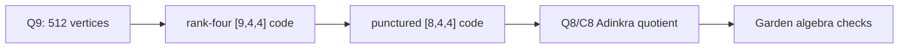

# Hypercube and Adinkra Visual Guide

## Hypercube layer

The base finite geometry is `Q9`, the graph of `F_2^9`.

| Quantity | Value |
|---|---|
| Vertices | 512 |
| Edges | 2304 |
| Vertex degree | 9 |
| Hamming shells | 10 |

The Hamming-shell counts are:

```text
1, 9, 36, 84, 126, 126, 84, 36, 9, 1
```

## Code layer

The canonical `[9,4,4]` code acts by XOR translation. It is rank four and doubly even. It is not self-dual in nine dimensions.

## Adinkra layer

Puncturing the invariant coordinate gives a self-dual doubly-even `[8,4,4]` code. The quotient `Q8/C8` has 16 vertices and supports exact N=8 Garden matrices.



## Evidence

- `figures/hypercube-3d-projection.png`
- `figures/adinkra-graph-colored.png`
- `src/ash_model/hypercube.py`
- `src/ash_model/adinkra.py`
- `tests/test_projection_adinkra.py`
