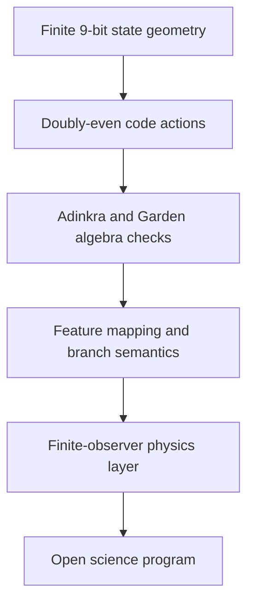

# Introduction to ASH Model

ASH is organized as a layered reference system. Each layer has a different evidence status.

## What is verified

- finite hypercube counts and adjacency;
- parity-valid state geometry;
- code rank, distance, weights, dual relation, and decoder behavior;
- exact quotient and Garden-algebra identities;
- deterministic mapping, reconstruction, branch, and pruning semantics;
- finite-observer pair-flip dynamics and internal observables.

## What remains open

- unit-bearing physical interpretation;
- bridge maps to external observables;
- metric, light-cone, or relativistic interpretation;
- external dataset ingestion and covariance handling;
- matched baseline likelihood comparisons;
- locked prospective or held-out predictions.

## Claim discipline

The repository may state finite theorems and implementation results when they are backed by proof certificates, tests, manifests, or audit reports. It does not claim empirical cosmology completion.
