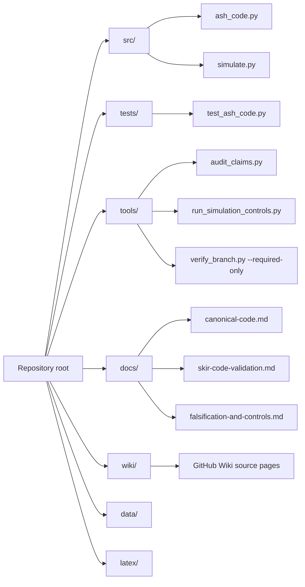

# Repository Structure

This page maps the current `main` branch after the Skir merge.

## Structure map

## Top-level files

| Path | Purpose |
|---|---|
| `README.md` | Main project entrypoint, quick start, Skir summary |
| `CONTRIBUTING.md` | Contribution requirements and validation commands |
| `CODE_OF_CONDUCT.md` | Collaboration and discussion standards |
| `LICENSE` | Custom restrictive license |
| `VERSION` | Current repository version string |
| `axioms-of-existence.json` | Modal-logic axiom set |
| `simulation.py` | Visualization-focused noisy-mixing demo |
| `changelog/CHANGELOG.md` | Release and documentation change history |

## Code and tests

| Path | Purpose |
|---|---|
| `src/ash_code.py` | Canonical Skir code layer and explicit nearest-codeword decoder |
| `src/simulate.py` | Data-focused simulation script that writes `data/simulation-results.csv` |
| `src/derive-9-properties.py` | Symbolic and mathematical derivation helper |
| `tests/test_ash_code.py` | Rank, span, distance, parity, and decoder tests |

## Tools

| Path | Purpose |
|---|---|
| `tools/audit_claims.py` | Guards docs and source against unsupported Skir claim language |
| `tools/audit_simulation_data.py` | Validates the structure of `data/simulation-results.csv` |
| `tools/run_simulation_controls.py` | Runs ASH/no-transform/random-transform controls |
| `tools/verify_branch.py --required-only` | Verifies required Skir files on current `main` |
| `scripts/final_gate.sh` | Historical Skir branch final gate retained for branch-era traceability |
| `scripts/local_precheck.sh` | Runs the local precheck subset |

## Documentation

| Path | Purpose |
|---|---|
| `docs/skir-merged-overview.md` | Merged Skir overview and navigation map |
| `docs/canonical-code.md` | Canonical code definition and formulas |
| `docs/skir-code-validation.md` | Code-theoretic validation details |
| `docs/falsification-and-controls.md` | Supported claims, unsupported claims, and control logic |
| `docs/claim-language-policy.md` | Required claim wording and prohibited overclaims |
| `docs/repository-review.md` | Current consistency review |
| `docs/ASH-research-paper.md` | Markdown manuscript narrative |
| `latex/main.tex` | Publication-oriented LaTeX manuscript source |

## Data and figures

| Path | Purpose |
|---|---|
| `data/simulation-results.csv` | Sample data output from `src/simulate.py` |
| `data/simulation-controls.json` | Control output from `tools/run_simulation_controls.py` |
| `figures/adinkra-graph-colored.png` | Adinkra visual |
| `figures/hypercube-3d-projection.png` | Hypercube projection visual |
| `figures/simulation-histogram.png` | Simulation occupancy visual |
| `figures/single-bit-error.png` | Single-bit error visual |
