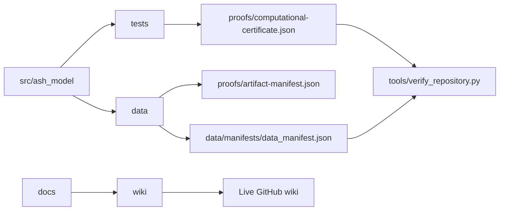

# Repository Structure

- `src/ash_model/` - canonical implementation
- `tests/` - exhaustive deterministic tests
- `config/` - normative mapping configuration
- `proofs/` - computational certificate and hashes
- `data/` - generated code, state, branch, simulation, ablation, and ASH-Cosmology roadmap artifacts
- `figures/` - generated evidence figures, including finite perturbation and finite-observer hierarchy figures
- `docs/` - specification, proof, controls, integration, and paper
- `docs/ash-physics-validation/` - ASH-Physics proof and empirical-validation planning package
- `docs/remediation/` - final repository-readiness and physics-readiness evidence
- `theory/` - finite-observer postulates, dynamics, bridge maps, and equation boundaries
- `phenomenology/` - observable-interface specifications and external-validation blockers
- `validation/` - finite consistency gates, preregistration surfaces, and external-validation blockers
- `predictions/` - prediction ledger and falsification criteria
- `latex/` - manuscript source
- `tools/` - artifact, proof, and repository verification commands
- `wiki/` - repository-hosted wiki source
- `CITATION.cff` - machine-readable citation metadata

## Evidence relationships

## Publication surfaces

| Surface | Purpose |
|---|---|
| `README.md` | repository entry point |
| `docs/` | authoritative reports, specifications, audits, and planning packages |
| `ROADMAP.md` | canonical roadmap tracker and completion log |
| `wiki/` | reviewable wiki source |
| live GitHub wiki | public wiki pages |
