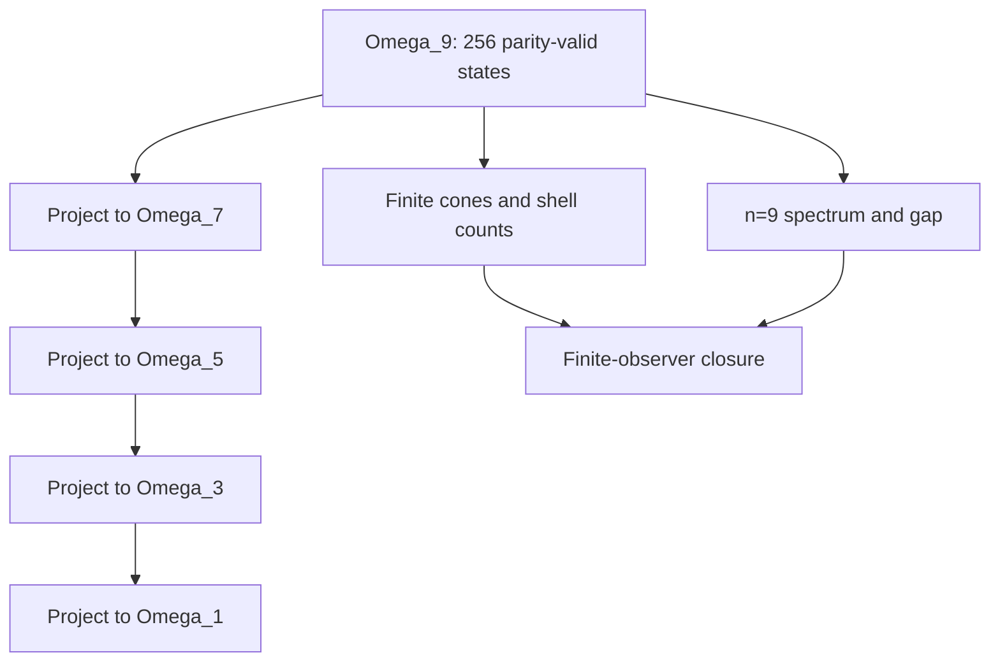

# Roadmap 011 Finite-Observer Limit

Roadmap 011 closes the finite-observer route for the current repository scope. It does not claim a differentiable continuum or physical spacetime metric.

## Finite hierarchy

For odd observer levels

\[
n\in\{1,3,5,7,9\},
\]

the state space is

\[
\Omega_n=\{x\in\mathbb F_2^n:\sum_i x_i=0\pmod 2\}.
\]

The finite event relation is pair-flip adjacency:

\[
x\sim_n y \iff d_H(x,y)=2,
\]

with graph distance

\[
d_n(x,y)=\frac{1}{2}d_H(x,y).
\]

## Projective observer maps

For \(m\le n\), the observer projection is

\[
\pi_{m,n}(x_1,\ldots,x_n)
=
(x_1,\ldots,x_{m-1},\sum_{i=1}^{m-1}x_i \bmod 2).
\]

The repository verifies:

- \(|\Omega_n|=2^{n-1}\);
- projective consistency \(\pi_{\ell,m}\circ\pi_{m,n}=\pi_{\ell,n}\);
- uniform fibers \(|\pi_{m,n}^{-1}(y)|=2^{n-m}\);
- finite shell counts \(|S_r^{(n)}|=\binom{n}{2r}\);
- finite cone counts \(|J^+_r(x)|=\sum_{q=0}^r\binom{n}{2q}\);
- non-expansion of microscopic pair-flip events under projection.

## R-011 evidence

| Evidence | Path |
|---|---|
| Implementation | `src/ash_model/finite_observer_limit.py` |
| Generator | `tools/generate_finite_observer_limit.py` |
| Contract | `config/ash_r011_finite_observer_limit_contract.json` |
| Tests | `tests/test_finite_observer_limit.py` |
| Documentation | `docs/ash-cosmology/finite-observer-limit/roadmap-011/README.md` |
| Formal expressions | `docs/ash-cosmology/finite-observer-limit/roadmap-011/r011_formal_expressions.json` |
| Data outputs | `data/ash-cosmology/finite-observer-limit/v0.1/` |
| Figures | `figures/ash-cosmology/finite-observer-limit/v0.1/` |
| Validation output | `validation/finite-observer-limit/roadmap-011/outputs/verification.json` |

## Visual logic



## Verification

```bash
python tools/generate_finite_observer_limit.py --out-root . --refresh-figures
python -m pytest tests/test_finite_observer_limit.py
python tools/run_proof_suite.py
python tools/verify_repository.py
python tools/validate_data_manifest.py --manifest data/manifests/data_manifest.json
```

## Boundary

R-011 closes only the finite-observer limit route. It does not derive a differentiable continuum, Lorentzian metric, physical light cone, Einstein equations, FRW/LCDM dynamics, physical perturbation equations, CMB or matter spectra, external likelihoods, empirical cosmology validation, or locked scientific prediction.
