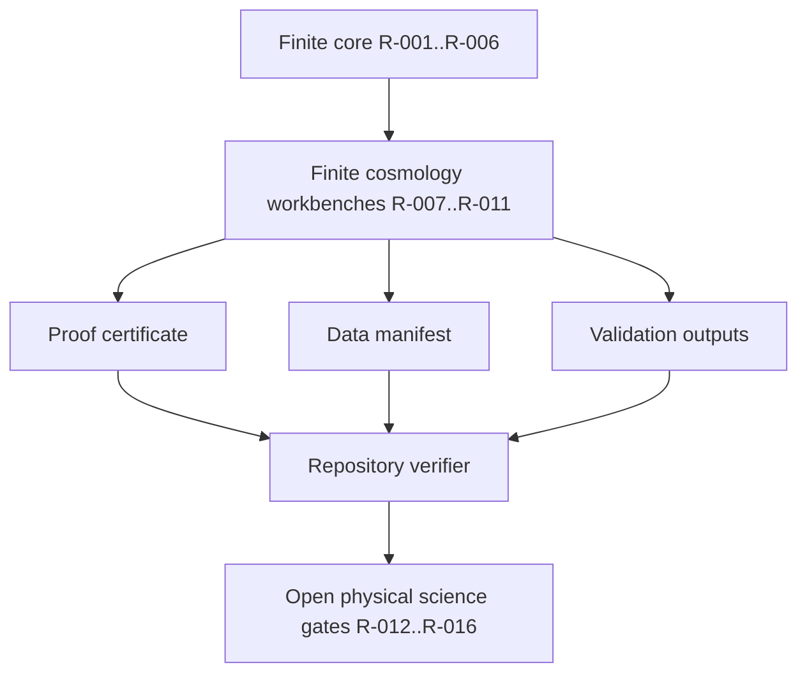

# Roadmap Tracker

`ROADMAP.md` is the repository-maintained status log for ASH Model roadmap items. This wiki page summarizes the current public state and points back to the tracked evidence.

## Snapshot

| Roadmap item | Status | Closure scope |
|---|---|---|
| R-001 finite ASH algebra and canonical mapping | Complete | Verified finite mathematics and mapping semantics. |
| R-002 finite-observer state layer | Complete | Finite parity-valid state space and pair-flip dynamics. |
| R-003 prediction-ledger mechanics | Complete | Hash-lock validation mechanics; no scientific prediction is locked. |
| R-004 sector-mixing pass 002 | Complete | Finite payload-coordinate workbench. |
| R-005 background bridge pass 003 | Complete | Synthetic diagnostics only. |
| R-006 data governance manifest | Complete | Manifest, validator, and regression coverage. |
| R-007 finite perturbation sector | Complete | Quotient-shell transfer mathematics only. |
| R-008 branch-measure law | Complete | Finite branch normalization only. |
| R-009 observer commitment | Complete | Finite committed-memory and branch-separation workbench only. |
| R-010 unit-bearing bridge | Complete | Synthetic fiducial proxy bridge only. |
| R-011 finite-observer limit | Complete | Nested finite observer hierarchy only. |
| R-012 background equations | Blocked | Requires ASH-derived physical background equations. |
| R-013 physical perturbation solver | Blocked | Requires physical perturbation variables and solver. |
| R-014 external likelihoods | Blocked | Requires reviewed data, covariance, baselines, and preregistration. |
| R-015 locked predictions | Blocked | Requires frozen prediction-ledger entries. |
| R-016 model closure | Open | Requires integrated branch-centered cosmology closure. |

## Evidence flow

## Current priority queue

| Priority | Work | Required closure evidence |
|---:|---|---|
| 1 | Physical perturbation equations and solver | Derivation, solver, parameter semantics, tests, and boundary documentation. |
| 2 | Background equations and standard-baseline relation | ASH-derived background equation, implementation, comparison tests, and documented limits. |
| 3 | External likelihoods and matched baselines | Data products, covariance inputs, preregistered likelihoods, and matched controls. |
| 4 | Locked prospective or held-out predictions | Frozen prediction records, hashes, input freeze date, and falsification criteria. |
| 5 | Branch-centered cosmology model closure | Integrated finite workbenches, bridge-map relation, validation boundaries, and model-closure evidence. |

## Rule for completion

A roadmap item is complete only when the repository contains the implementation or derivation, evidence paths, verification commands, and a boundary statement. A planning file, scaffold, or empty ledger does not close a science gate.
