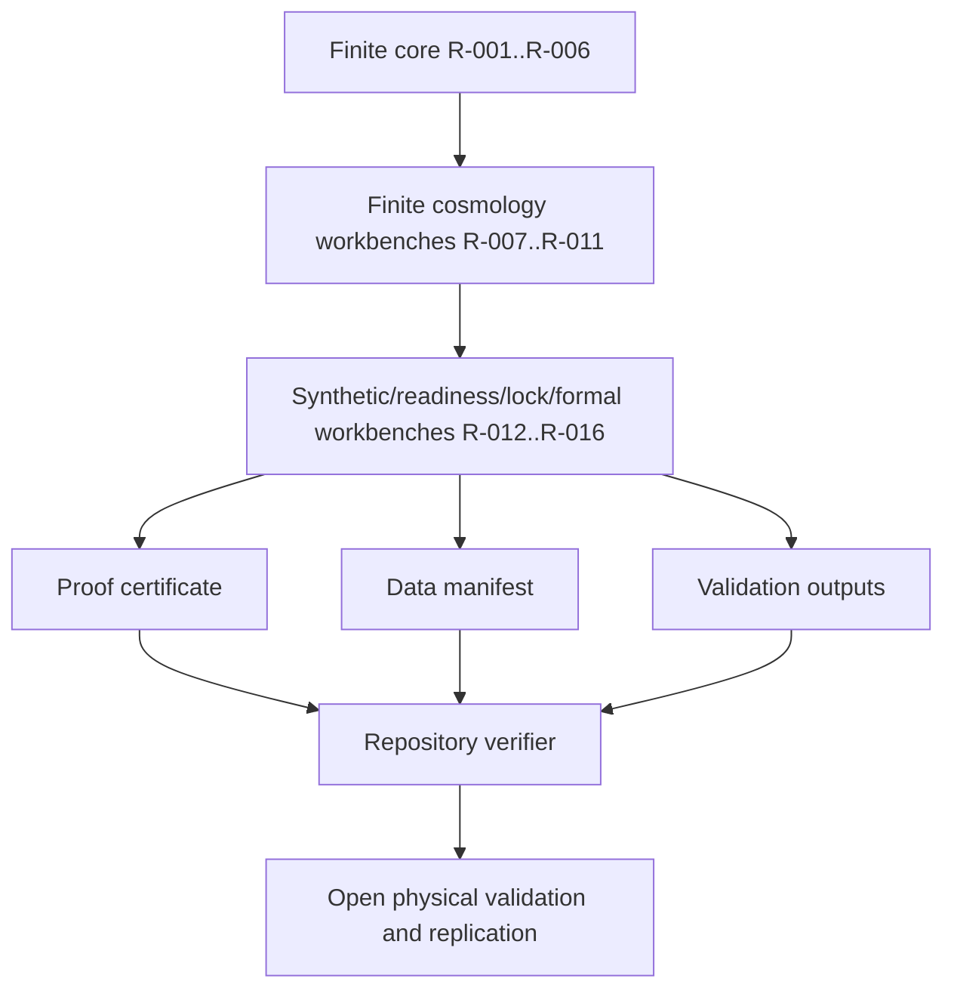

# Roadmap Tracker

`ROADMAP.md` is the repository-maintained status log for ASH Model roadmap items. This wiki page summarizes the current public state and points back to the tracked evidence.

## Snapshot

| Roadmap item | Status | Closure scope |
|---|---|---|
| R-001 finite ASH algebra and canonical mapping | Complete | Verified finite mathematics and mapping semantics. |
| R-002 finite-observer state layer | Complete | Finite parity-valid state space and pair-flip dynamics. |
| R-003 prediction-ledger mechanics | Complete | Hash-lock validation mechanics; R-015 later adds locked prospective templates. |
| R-004 sector-mixing pass 002 | Complete | Finite payload-coordinate workbench. |
| R-005 background bridge pass 003 | Complete | Synthetic diagnostics only. |
| R-006 data governance manifest | Complete | Manifest, validator, and regression coverage. |
| R-007 finite perturbation sector | Complete | Quotient-shell transfer mathematics only. |
| R-008 branch-measure law | Complete | Finite branch normalization only. |
| R-009 observer commitment | Complete | Finite committed-memory and branch-separation workbench only. |
| R-010 unit-bearing bridge | Complete | Synthetic fiducial proxy bridge only. |
| R-011 finite-observer limit | Complete | Nested finite observer hierarchy only. |
| R-012 background equations | Complete | Synthetic finite-observer background-equation workbench and standard-baseline relation only. |
| R-013 physical perturbation solver | Complete | Bounded matter-sector perturbation workbench only; no full Boltzmann hierarchy. |
| R-014 external likelihoods | Complete | Likelihood-readiness contracts, matched synthetic baselines, metadata-only registry, and synthetic fixtures only. |
| R-015 locked predictions | Complete | Immutable prospective prediction templates and falsification metadata only; no observed-data result. |
| R-016 model closure | Complete | Formal branch-centered repository-contract closure only; no empirical validation or physical model validation. |

## Evidence flow

## Current priority queue

| Priority | Work | Required closure evidence |
|---:|---|---|
| - | No active R-001 through R-016 integration item | Remaining work is reviewed physical calibration, observed-data likelihood scoring, empirical validation, physical model validation, and independent replication. |

## Rule for completion

A roadmap item is complete only when the repository contains the implementation or derivation, evidence paths, verification commands, and a boundary statement. A planning file, scaffold, or empty ledger does not close a science gate.
