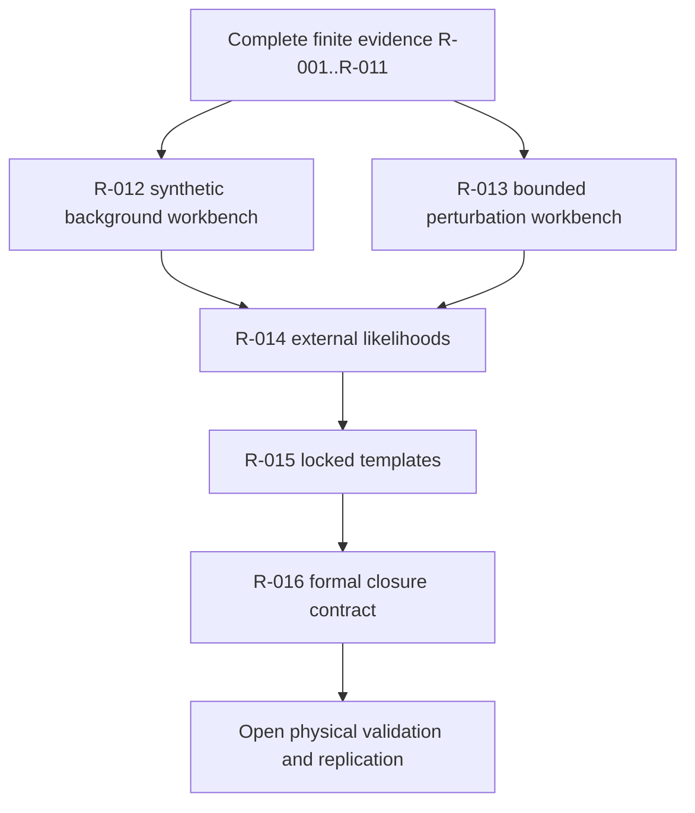

# Science Roadmap

The repository roadmap is complete through Roadmap 016 within the stated finite, synthetic, readiness, lock-mechanics, and formal-contract scopes. The physical science program remains open: R016 is not empirical validation, observed-data likelihood scoring, physical model validation, or independent replication.

## Current roadmap state

| Roadmap band | Status | Meaning |
|---|---|---|
| R-001 to R-006 | Complete | Finite core, finite-observer physics layer, prediction-ledger mechanics, sector-mixing workbench, background-bridge diagnostics, and data governance. |
| R-007 | Complete finite perturbation sector | Quotient Walsh-shell mathematics and finite transfer artifacts only. |
| R-008 | Complete finite branch-measure law | Finite normalization law only; no Born-rule proof. |
| R-009 | Complete finite observer-commitment workbench | Committed-memory and branch-separation checks only. |
| R-010 | Complete synthetic unit-bearing bridge | Fiducial proxy observables only; no reviewed physical calibration. |
| R-011 | Complete finite-observer limit route | Nested finite hierarchy only; no differentiable continuum or physical metric. |
| R-012 | Complete synthetic background-equation workbench | Exact standard-baseline relation and synthetic finite-observer source only; no physical FRW or Einstein-equation derivation. |
| R-013 | Complete bounded matter-sector perturbation workbench | Finite-to-physical modifiers and matter-growth proxy only; no full photon-baryon Boltzmann hierarchy. |
| R-014 | Complete external-likelihood readiness layer | Metadata-only registry, covariance policy, matched synthetic baselines, and synthetic fixtures only; no observed-data scoring. |
| R-015 | Complete locked prospective template mechanics | Immutable templates and falsification metadata only; future held-out comparison remains pending. |
| R-016 | Complete formal branch-centered closure contract | Repository-contract closure only; no empirical preference or physical model validation. |

## Open blockers

| Blocker | Required next evidence |
|---|---|
| Physical calibration | reviewed interpretation of ASH scales and state variables |
| Microscopic physical dynamics | derivation or justified stochastic model tied to physical assumptions |
| Physical causal structure | metric, physical light-cone, locality, or nonlocality account |
| Bridge to observables | reviewed unit-bearing map to measurable quantities |
| Differentiable continuum or explicit finite alternative for physical use | theorem, limit result, or stated finite-observer interpretation with physical semantics |
| Physical background equations | reviewed derivation connecting ASH variables to a physical FRW, Einstein-equation, or explicit finite-observer alternative |
| Physical perturbation equations | observable perturbation dynamics tied to survey quantities and gauge policy |
| Executable cosmology solver | production solver with documented physical parameters, outputs, and external-data interfaces |
| Observed-data likelihood scoring | official external data vectors, covariance products, preregistered unblinding, and matched baselines |
| Empirical validation | held-out comparisons, uncertainty accounting, and evidence of preference or falsification |
| Independent replication | reproducible third-party checks of derivations, code, data handling, and claims |

## Gate rule

A planning file, scaffold, or empty ledger does not close a science gate. A gate closes only when the repository contains the implementation, mathematical derivation or evidence, verification command, and written boundary statement.

Roadmaps close repository gates only within their stated scope:

- R-010 supplies a synthetic bridge workbench with fiducial SI-unit proxy columns.
- R-011 supplies a finite projective observer hierarchy with finite causal adjacency.
- R-012 through R-016 add synthetic background, bounded perturbation, likelihood-readiness, locked-template, and formal-closure machinery.
- None of these close empirical validation, reviewed physical calibration, observed-data likelihood scoring, physical model validation, or independent replication.

## Where to work next

- `theory/`
- `phenomenology/`
- `validation/`
- `predictions/`
- `proofs/physics-proof-obligations.md`
- `ROADMAP.md`
