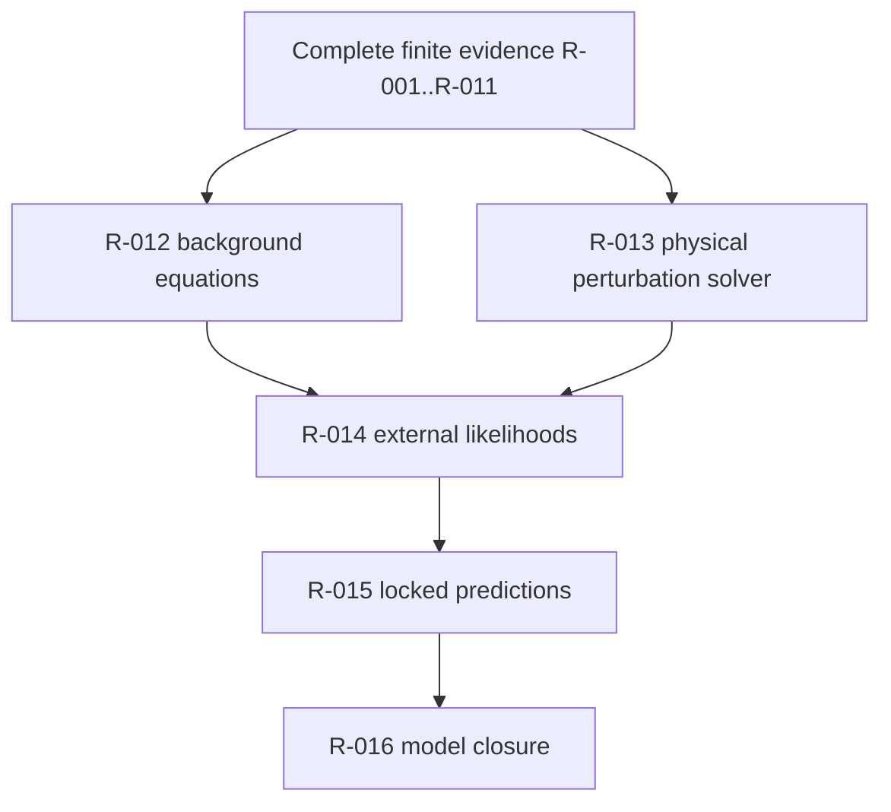

# Science Roadmap

The finite repository layer is ready through Roadmap 011. The physical science program remains open.

## Current roadmap state

| Roadmap band | Status | Meaning |
|---|---|---|
| R-001 to R-006 | Complete | Finite core, finite-observer physics layer, prediction-ledger mechanics, sector-mixing workbench, background-bridge diagnostics, and data governance. |
| R-007 | Complete finite perturbation sector | Quotient Walsh-shell mathematics and finite transfer artifacts only. |
| R-008 | Complete finite branch-measure law | Finite normalization law only; no Born-rule proof. |
| R-009 | Complete finite observer-commitment workbench | Committed-memory and branch-separation checks only. |
| R-010 | Complete synthetic unit-bearing bridge | Fiducial proxy observables only; no reviewed physical calibration. |
| R-011 | Complete finite-observer limit route | Nested finite hierarchy only; no differentiable continuum or physical metric. |
| R-012 to R-016 | Open or blocked | Requires derivations, calibration, solvers, external validation, locked predictions, and model closure. |

## Open blockers

| Blocker | Required next evidence |
|---|---|
| Physical calibration | reviewed interpretation of ASH scales and state variables |
| Microscopic physical dynamics | derivation or justified stochastic model tied to physical assumptions |
| Physical causal structure | metric, physical light-cone, locality, or nonlocality account |
| Bridge to observables | reviewed unit-bearing map to measurable quantities |
| Differentiable continuum or explicit finite alternative for physical use | theorem, limit result, or stated finite-observer interpretation with physical semantics |
| Background equations | derived external cosmology equations |
| Perturbation equations | observable perturbation dynamics |
| Executable cosmology solver | solver with documented parameters and outputs |
| Synthetic recovery | recovery tests against known generated targets |
| Matched ablations | comparisons against standard and non-ASH baselines |
| Baseline limit | clear standard-baseline relation or failure mode |
| Locked prediction | preregistered held-out or prospective prediction |

## Gate rule

A planning file, scaffold, or empty ledger does not close a science gate. A gate closes only when the repository contains the implementation, mathematical derivation or evidence, verification command, and written boundary statement.

R-010 and R-011 close finite repository gates only:

- R-010 supplies a synthetic bridge workbench with fiducial SI-unit proxy columns.
- R-011 supplies a finite projective observer hierarchy with finite causal adjacency.
- Neither closes empirical validation, physical calibration, CMB/matter spectra, external likelihoods, or locked predictions.

## Where to work next

- `theory/`
- `phenomenology/`
- `validation/`
- `predictions/`
- `proofs/physics-proof-obligations.md`
- `ROADMAP.md`
