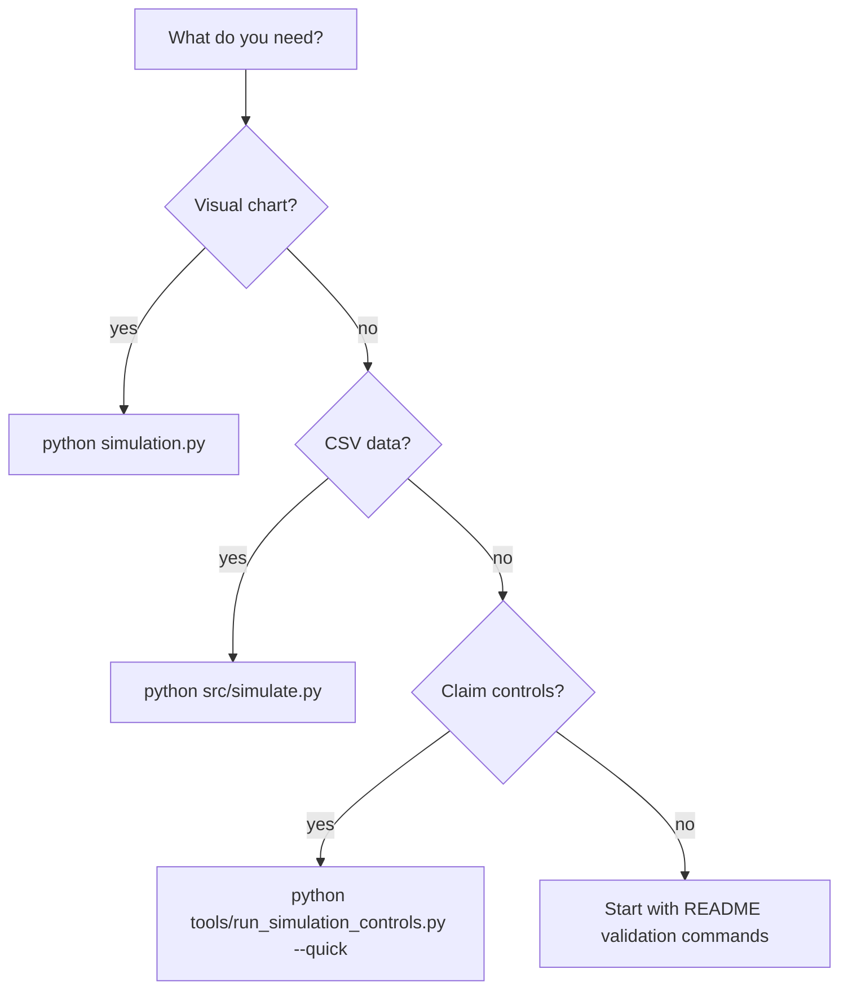

# Simulation Guide

ASH exposes three executable paths. Each path has a different evidentiary role.

## Script selection



## 1. Visualization path

Use `simulation.py` when you want a plotted occupancy distribution.

```bash
python simulation.py
```

Expected behavior:

- runs agent dynamics on a 9D binary state space;
- applies canonical ASH codeword transforms and low-probability noise;
- writes `figures/simulation-histogram-generated.png`;
- prints final occupancy per Hamming-weight plane.

## 2. Data path

Use `src/simulate.py` when you want raw matrix output.

```bash
python src/simulate.py
```

Expected behavior:

- runs a lightweight iterative transformation loop;
- writes `data/simulation-results.csv`;
- prints a summary distribution and output location.

## 3. Skir controls

Use `tools/run_simulation_controls.py` when documentation or analysis depends on conservative control comparisons.

```bash
python tools/run_simulation_controls.py --quick
```

Expected behavior:

- compares canonical codeword transforms against no-transform and random-transform baselines;
- writes `data/simulation-controls.json`;
- prints total-variation distance to the binomial/Haar occupancy envelope for each run.

## Control scenarios

| Scenario | Start | Transform | Noise | Purpose |
|---|---|---|---|---|
| `random_start_ash_noise` | random | ASH transforms | yes | Main noisy ASH comparison |
| `random_start_no_transform_noise` | random | none | yes | Noise-only baseline |
| `random_start_random_transform_noise` | random | random masks | yes | Non-ASH transform baseline |
| `zero_start_ash_no_noise` | zero | ASH transforms | no | Deterministic confinement check |
| `zero_start_ash_noise` | zero | ASH transforms | yes | Noise recovery from atypical start |

## Interpretation boundary

The controls support language about noisy hypercube mixing. They do not prove that ASH codewords uniquely cause an occupancy distribution, and they do not prove physical cosmology.

## Troubleshooting

Install dependencies first:

```bash
python -m pip install numpy matplotlib sympy pytest
```
