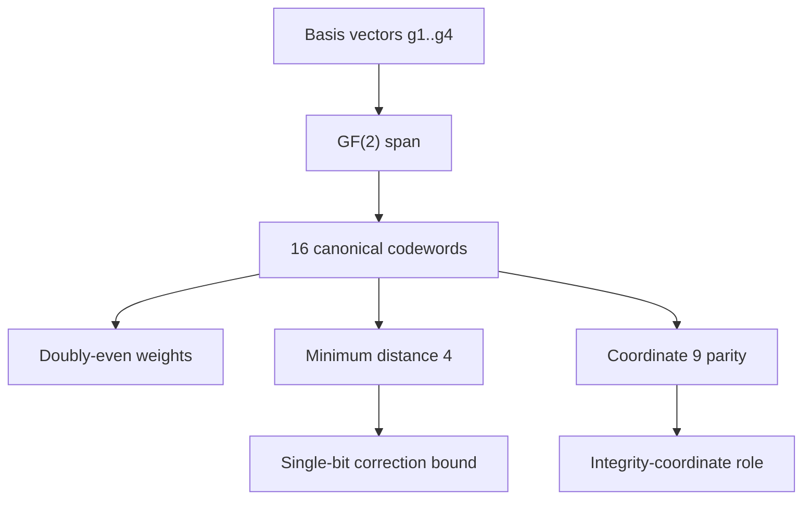

# Skir Canonical Code

Skir defines the canonical ASH code layer as a parity-explicit rank-4 doubly-even linear `[9,4,4]` code over `F2^9`.

## Code definition

The canonical basis is:

```text
g1 = 1 1 1 1 0 0 0 0 0
g2 = 1 1 0 0 1 1 0 0 0
g3 = 1 0 1 0 1 0 1 0 0
g4 = 1 0 0 1 1 0 0 0 1
```

The code is:

```text
C = span_F2({g1, g2, g3, g4})
```

Two additional canonical transform masks used by simulation scripts are in the same span:

```text
g5 = 1 1 1 1 1 1 1 0 1
g6 = 0 0 0 0 1 1 1 0 1
```

## Verified properties

| Property | Value |
|---|---:|
| Length | 9 |
| Rank | 4 |
| Span size | 16 |
| Minimum distance | 4 |
| Weight distribution | `{0: 1, 4: 14, 8: 1}` |
| Doubly-even | yes |
| Coordinate 9 active | yes |
| Coordinate 9 parity-valid | yes |
| Self-dual | no |

## Parity relation

For every canonical codeword `c`:

```text
c9 = c1 xor c2 xor c3 xor c4 xor c5 xor c6 xor c7 xor c8
```

Coordinate 9 is therefore an integrity coordinate for canonical codewords. Human coordinate 8 is fixed to 0 in the current canonical presentation.

## Visual model



## Decoder boundary

The decoder in `src/ash_code.py` classifies a received vector as:

| Status | Meaning |
|---|---|
| `valid` | The received vector is already a canonical codeword. |
| `corrected` | The received vector has a unique nearest canonical codeword within radius 1. |
| `ambiguous` | More than one nearest codeword exists. |
| `uncorrectable` | The nearest codeword is outside the default correction radius. |

The standard bound is:

```text
2t < d
2(1) < 4
```

So the explicit decoder supports unique single-bit correction around canonical codewords.
