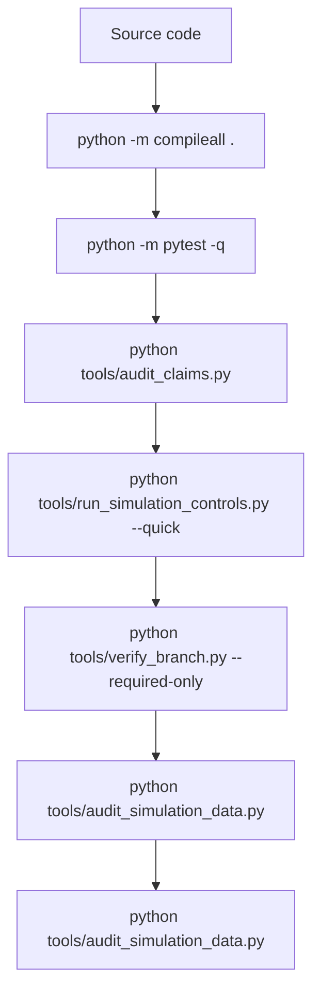
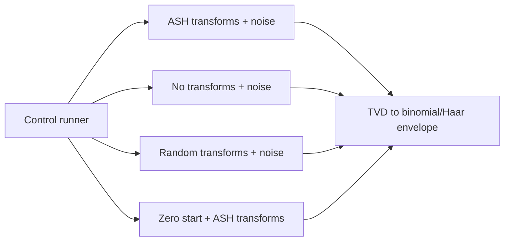

# Skir Validation and Controls

Skir validation keeps code-theoretic claims, simulation controls, and documentation language aligned.

## Validation stack



## Commands

```bash
python -m pip install numpy matplotlib sympy pytest
python -m compileall .
python -m pytest -q
python tools/audit_claims.py
python tools/run_simulation_controls.py --quick
python tools/verify_branch.py --required-only
python tools/audit_simulation_data.py
```

## What the tests prove

`tests/test_ash_code.py` verifies:

- length 9;
- rank 4;
- span size 16;
- doubly-even codewords;
- minimum distance 4;
- coordinate 9 parity relation;
- coordinate 9 activity;
- valid-codeword decoding;
- single-bit correction around every canonical codeword;
- no silent correction of double-bit errors by default.

## Control comparison



## Interpretation

The controls compare ASH codeword transforms with no-transform and random-transform baselines. If multiple noisy scenarios approach the same envelope, documentation should say noisy hypercube mixing rather than attributing the result uniquely to ASH codewords.

## Supported claims

| Claim | Evidence |
|---|---|
| Canonical code has rank 4 | `tests/test_ash_code.py` |
| Canonical code has 16 codewords | `tests/test_ash_code.py` |
| Canonical code is doubly-even | `tests/test_ash_code.py` |
| Canonical code has minimum distance 4 | `tests/test_ash_code.py` |
| Coordinate 9 is parity/integrity | `tests/test_ash_code.py` |
| Single-bit errors are corrected by explicit decoder | `tests/test_ash_code.py` |
| Double-bit errors are not silently corrected | `tests/test_ash_code.py` |
| Noisy runs can be compared to a binomial/Haar envelope | `tools/run_simulation_controls.py` |

## Unsupported claims

| Claim | Status |
|---|---|
| The code is self-dual | false |
| Simulation proves Hamming-bound resilience | unsupported |
| ASH codewords uniquely cause a specific occupancy distribution | unsupported |
| ASH is empirically validated physical cosmology | not established |
