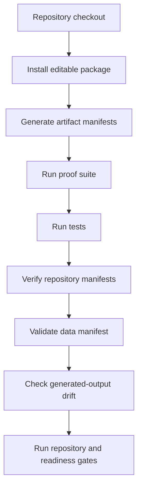

# Validation and Data Audit

## Validation stack



## Current command set

```bash
python -m pip install -e ".[dev]"
python tools/generate_artifacts.py
python tools/build_manuscript.py
python tools/run_proof_suite.py
python -m pytest
python tools/verify_repository.py
python docs/ash-physics-validation/scripts/check_claim_language.py .
python docs/ash-physics-validation/scripts/check_sensitive_language.py .
python docs/ash-physics-validation/scripts/run_repository_gate.py .
python tools/validate_json_assets.py .
python tools/validate_data_manifest.py --manifest data/manifests/data_manifest.json
python tools/check_generated_outputs.py . --include-manuscript
python tools/audit_physics_readiness.py . --expect-open --write-json docs/remediation/physics-readiness.json
python tools/audit_live_repository_readiness.py .
python tools/final_repository_audit.py . --write-json docs/remediation/final-remediation-evidence.json
```

## Current result

| Check | Result |
|---|---|
| Proof suite | all checks pass |
| Tests | 143 collected tests |
| Repository verifier | no mismatches |
| JSON schema validation | pass |
| Data manifest validation | pass |
| Generated-output check | pass |
| Live repository readiness | pass |
| Physics readiness | not ready; finite R010/R011 scopes are complete, but physical calibration, background dynamics, physical perturbation, external-likelihood, empirical-validation, locked-prediction, and model-closure gates remain open or blocked |

## Current finite validation coverage

| Area | Test or gate |
|---|---|
| Finite algebra and decoder | `tests/test_bits_hypercube.py`, `tests/test_code.py`, `tools/run_proof_suite.py` |
| Finite-observer physics | `tests/test_physics.py`, `tests/test_empirical_bridge.py`, `tests/test_cosmology.py` |
| R-007 perturbation sector | `tests/test_linear_perturbations.py` |
| R-008 branch measure | `tests/test_branch_measure.py` |
| R-009 observer commitment | `tests/test_observer_commitment.py` |
| R-010 unit bridge | `tests/test_unit_bridge.py` |
| R-011 finite-observer hierarchy | `tests/test_finite_observer_limit.py` |
| Data governance | `tools/validate_data_manifest.py --manifest data/manifests/data_manifest.json` |
| Publication drift | `tools/check_generated_outputs.py . --include-manuscript` |

## Audit files

- `docs/final-live-repository-audit.md`
- `docs/remediation/final-remediation-evidence.json`
- `docs/remediation/physics-readiness.json`
- `validation/status.json`
