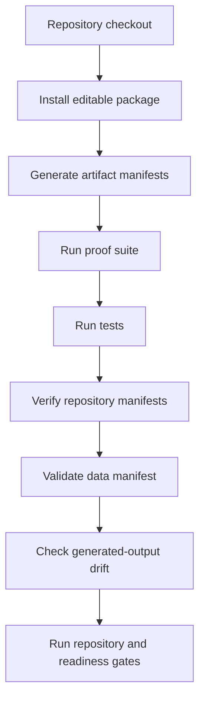

# Validation and Data Audit

## Validation stack



## Current command set

```bash
python3 -m pip install -e ".[dev]"
python3 tools/generate_artifacts.py
python3 tools/build_manuscript.py
python3 tools/run_proof_suite.py
python3 -m pytest
python3 tools/verify_repository.py
python3 docs/ash-physics-validation/scripts/check_claim_language.py .
python3 docs/ash-physics-validation/scripts/check_sensitive_language.py .
python3 docs/ash-physics-validation/scripts/run_repository_gate.py .
python3 tools/validate_json_assets.py .
python3 tools/validate_data_manifest.py --manifest data/manifests/data_manifest.json
python3 tools/check_generated_outputs.py . --include-manuscript
python3 tools/audit_physics_readiness.py . --expect-open --write-json docs/remediation/physics-readiness.json
python3 tools/audit_live_repository_readiness.py .
python3 tools/final_repository_audit.py . --write-json docs/remediation/final-remediation-evidence.json
```

## Current result

| Check | Result |
|---|---|
| Proof suite | all checks pass |
| Tests | collected and run by `python3 -m pytest` |
| Repository verifier | no mismatches |
| JSON schema validation | pass |
| Data manifest validation | pass |
| Generated-output check | pass |
| Live repository readiness | pass |
| Physics readiness | not ready as physical cosmology; R001-R016 repository scopes are complete, but reviewed physical calibration, observed-data likelihood scoring, empirical validation, physical model validation, and independent replication remain open |

## Current finite validation coverage

| Area | Test or gate |
|---|---|
| Finite algebra and decoder | `tests/test_bits_hypercube.py`, `tests/test_code.py`, `tools/run_proof_suite.py` |
| Finite-observer physics | `tests/test_physics.py`, `tests/test_empirical_bridge.py`, `tests/test_cosmology.py` |
| R-007 perturbation sector | `tests/test_linear_perturbations.py` |
| R-008 branch measure | `tests/test_branch_measure.py` |
| R-009 observer commitment | `tests/test_observer_commitment.py` |
| R-010 unit bridge | `tests/test_unit_bridge.py` |
| R-011 finite-observer hierarchy | `tests/test_finite_observer_limit.py` |
| R-012 background-equation workbench | `tests/test_cosmological_background.py` |
| R-013 physical-perturbation workbench | `tests/test_physical_perturbations.py` |
| R-014 external-likelihood readiness | `tests/test_external_likelihoods.py` |
| R-015 locked prediction templates | `tests/test_locked_predictions.py` |
| R-016 branch-centered closure | `tests/test_branch_centered_closure.py` |
| Data governance | `tools/validate_data_manifest.py --manifest data/manifests/data_manifest.json` |
| Publication drift | `tools/check_generated_outputs.py . --include-manuscript` |

## Audit files

- `docs/final-live-repository-audit.md`
- `docs/remediation/final-remediation-evidence.json`
- `docs/remediation/physics-readiness.json`
- `validation/status.json`
